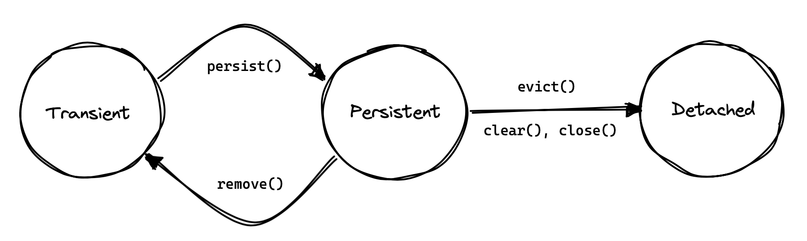

[[interacting]]
== Interacting with the database

To interact with the database, that is, to execute queries, or to insert, update, or delete data, we need an instance of one of the following objects:

- a JPA `EntityManager`,
- a Hibernate `Session`, or
- a Hibernate `StatelessSession`.

The `Session` interface extends `EntityManager`, and so the only difference between the two interfaces is that `Session` offers a few more operations.

[TIP]
// .The `Session` hiding inside an `EntityManager`
====
Actually, in Hibernate, every `EntityManager` is a `Session`, and you can narrow it like this:

[source,java]
----
Session session = entityManager.unwrap(Session.class);
----
====

An instance of `Session` (or of `EntityManager`) is a _stateful session_.
It mediates the interaction between your program and the database via a operations on a _persistence context_.

In this chapter, we're not going to talk much about `StatelessSession`.
We'll come back to <<stateless-sessions,this very useful API>> when we talk about performance.
What you need to know for now is that a stateless session doesn't have a persistence context.

[TIP]
// .Some people prefer `StatelessSession`
====
Still, we should let you know that some people prefer to use `StatelessSession` everywhere.
It's a simpler programming model, and lets the developer interact with the database more _directly_.

Stateful sessions certainly have their advantages, but they're more difficult to reason about, and when something goes wrong, the error messages can be more difficult to understand.
====

[[persistence-contexts]]
=== Persistence Contexts

A persistence context is a sort of cache; we sometimes call it the "first-level cache", to distinguish it from the <<second-level-cache,second-level cache>>.
For every entity instance read from the database within the scope of a persistence context, and for every new entity made persistent within the scope of the persistence context, the context holds a unique mapping from the identifier of the entity instance to the instance itself.

Thus, an entity instance may be in one of three states with respect to a given persistence context:

1. _transient_ — never persistent, and not associated with the persistence context,
2. _persistent_ — currently associated with the persistence context, or
3. _detached_ — previously persistent in another session, but not currently associated with _this_ persistence context.

At any given moment, an instance may be associated with at most one persistence context.

The lifetime of a persistence context usually corresponds to the lifetime of a transaction, though it's possible to have a persistence context that spans several database-level transactions that form a single logical unit of work.

[WARNING]
====
A persistence context—that is, a `Session` or `EntityManager`—absolutely positively **must not be shared between multiple threads or between concurrent transactions.**

If you accidentally leak a session across threads, you will suffer.
====

.Container-managed persistence contexts
****
In a container environment, the lifecycle of a persistence context scoped to the transaction will usually be managed for you.
****

There are several reasons we like persistence contexts.

1. They help avoid _data aliasing_: if we modify an entity in one section of code, then other code executing within the same persistence context will see our modification.
2. They enable _automatic dirty checking_: after modifying an entity, we don't need to perform any explicit operation to ask Hibernate to propagate that change back to the database.
   Instead, the change will be automatically synchronized with the database when the session is <<flush,flushed>>.
3. They can improve performance by avoiding a trip to the database when a given entity instance is requested repeatedly in a given unit of work.
4. They make it possible to _transparently batch_ together multiple database operations.

A persistence context also allows us to detect circularities when performing operations on graphs of entities.
(Even in a stateless session, we need some sort of temporary cache of the entity instances we've visited while executing a query.)

On the other hand, stateful sessions come with some very important restrictions, since:

- persistence contexts aren't threadsafe, and can't be shared across threads, and
- a persistence context can't be reused across unrelated transactions, since that would break the isolation and atomicity of the transactions.

Furthermore, a persistence context holds a hard references to all its entities, preventing them from being garbage collected.
Thus, the session must be discarded once a unit of work is complete.

[IMPORTANT]
// .This is important
====
If you don't completely understand the previous passage, go back and re-read it until you do.
A great deal of human suffering has resulted from users mismanaging the lifecycle of the Hibernate `Session` or JPA `EntityManager`.
====

We'll conclude by noting that whether a persistence context helps or harms the performance of a given unit of work depends greatly on the nature of the unit of work.
For this reason Hibernate provides both stateful and stateless sessions.

[[creating-session]]
=== Creating a session

Sticking with standard JPA-defined APIs, we saw how to obtain an `EntityManagerFactory` in <<configuration-jpa>>.
It's quite unsurprising that we may use this object to create an `EntityManager`:

[source,java]
----
EntityManager entityManager = entityManagerFactory.createEntityManager();
----

When we're finished with the `EntityManager`, we should explicitly clean it up:

[source,java]
----
entityManager.close();
----

On the other hand, if we're starting from a `SessionFactory`, as described in <<configuration-api>>, we may use:

[source,java]
----
Session session = sessionFactory.openSession();
----

But we still need to clean up:

[source,java]
----
session.close();
----

.Injecting the `EntityManager`
****
If you're writing code for some sort of container environment, you'll probably obtain the `EntityManager` by some sort of dependency injection.
For example, in Java (or Jakarta) EE you would write:

[source,java]
----
@PersistenceContext EntityManager entityManager;
----

In Quarkus, injection is handled by CDI:

[source,java]
----
@Inject EntityManager entityManager;
----
****

Outside a container environment, we'll also have to write code to manage database transactions.

[[managing-transactions]]
=== Managing transactions

Using JPA-standard APIs, the `EntityTransaction` interface allows us to control database transactions.
The idiom we recommend is the following:

[source,java]
----
EntityManager entityManager = entityManagerFactory.createEntityManager();
EntityTransaction tx = entityManager.getTransaction();
try {
    tx.begin();
    //do some work
    ...
    tx.commit();
}
catch (Exception e) {
    if (tx.isActive()) tx.rollback();
    throw e;
}
finally {
    entityManager.close();
}
----

Using Hibernate's native APIs we might write something really similar,
// [source,java]
// ----
// Session session = sessionFactory.openSession();
// Transaction tx = null;
// try {
//     tx = session.beginTransaction();
//     //do some work
//     ...
//     tx.commit();
// }
// catch (Exception e) {
//     if (tx!=null) tx.rollback();
//     throw e;
// }
// finally {
//     session.close();
// }
// ----
but since this sort of code is extremely tedious, we have a much nicer option:

[source,java]
----
sessionFactory.inTransaction(session -> {
    //do the work
    ...
});
----

.Container-managed transactions
****
In a container environment, the container itself is usually responsible for managing transactions.
In Java EE or Quarkus, you'll probably indicate the boundaries of the transaction using the `@Transactional` annotation.
****

JPA doesn't have a standard way to set the transaction timeout, but Hibernate does:

[source,java]
----
session.getTransaction().setTimeout(30); // 30 seconds
----

[[persistence-operations]]
=== Operations on the persistence context

Of course, the main reason we need an `EntityManager` is to do stuff to the database.
The following important operations let us interact with the persistence context and schedule modifications to the data:

.Methods for modifying data and managing the persistence context
[%breakable,cols="30,~"]
|===
| Method name and parameters | Effect

| `persist(Object)`
| Make a transient object persistent and schedule a SQL `insert` statement for later execution
| `remove(Object)`
| Make a persistent object transient and schedule a SQL `delete` statement for later execution
| `merge(Object)`
| Copy the state of a given detached object to a corresponding managed persistent instance and return
the persistent object
| `detach(Object)`
| Disassociate a persistent object from a session without
affecting the database
| `clear()`
| Empty the persistence context and detach all its entities
| `flush()`
| Detect changes made to persistent objects association with the session and synchronize the database state with the state of the session by executing SQL `insert`, `update`, and `delete` statements
|===

Notice that `persist()` and `remove()` have no immediate effect on the database, and instead simply schedule a command for later execution.
Also notice that there's no `update()` operation for a stateful session.
Modifications are automatically detected when the session is <<flush,flushed>>.

On the other hand, except for `getReference()`, the following operations all result in immediate access to the database:

.Methods for reading and locking data
[%breakable,cols="30,~"]
|===
| Method name and parameters | Effect

| `find(Class,Object)`
| Obtain a persistent object given its type and its id
| `find(Class,Object,LockModeType)`
| Obtain a persistent object given its type and its id, requesting the given <<optimistic-and-pessimistic-locking,optimistic or pessimistic lock mode>>
| `getReference(Class,id)`
| Obtain a reference to a persistent object given its type and its id, without actually loading its state from the database
| `getReference(Object)`
| Obtain a reference to a persistent object with the same identity as the given detached instance, without actually loading its state from the database
| `refresh(Object)`
| Refresh the persistent state of an object using a new SQL `select` to retrieve its current state from the database
| `refresh(Object,LockModeType)`
| Refresh the persistent state of an object using a new SQL `select` to retrieve its current state from the database, requesting the given <<optimistic-and-pessimistic-locking,optimistic or pessimistic lock mode>>
| `lock(Object, LockModeType)`
| Obtain an <<optimistic-and-pessimistic-locking,optimistic or pessimistic lock>> on a persistent object
|===

Any of these operations might throw an exception.
Now, if an exception occurs while interacting with the database, there's no good way to resynchronize the state of the current persistence context with the state held in database tables.

Therefore, a session is considered to be unusable after any of its methods throws an exception.

[IMPORTANT]
// .The persistence context is fragile
====
The persistence context is fragile.
If you receive an exception from Hibernate, you should immediately close and discard the current session. Open a new session if you need to, but throw the bad one away first.
====

Each of the operations we've seen so far affects a single entity instance passed as an argument.
But there's a way to set things up so that an operation will propagate to associated entities.

[[cascade]]
=== Cascading persistence operations

It's quite often the case that the lifecycle of a _child_ entity is completely dependent on the lifecycle of some _parent_.
This is especially common for many-to-one and one-to-one associations, though it's very rare for many-to-many associations.

For example, it's quite common to make an `Order` and all its ``Item``s persistent in the same transaction, or to delete a `Project` and its ``Files``s at once.
This sort of relationship is sometimes called a _whole/part_-type relationship.

_Cascading_ is a convenience which allows us to propagate one of the operations listed in <<persistence-operations>> from a parent to its children.
To set up cascading, we specify the `cascade` member of one of the association mapping annotations, usually `@OneToMany` or `@OneToOne`.

[source,java]
----
@Entity
class Order {
    ...
    @OneToMany(mappedby=Item_.ORDER,
               // cascade persist(), remove(), and refresh() from Order to Item
               cascade={PERSIST,REMOVE,REFRESH},
               // also remove() orphaned Items
               orphanRemoval=true)
    private Set<Item> items;
    ...
}
----

_Orphan removal_ indicates that an `Item` should be automatically deleted if it is removed from the set of items belonging to its parent `Order`.

[[proxies-and-lazy-fetching]]
=== Proxies and lazy fetching

Our data model is a set of interconnected entities, and in Java our whole dataset would be represented as an enormous interconnected graph of objects.
It's possible that this graph is disconnected, but more likely it's connected, or composed of a relatively small number of connected subgraphs.

Therefore, when we retrieve on object belonging to this graph from the database and instantiate it in memory, we simply can't recursively retrieve and instantiate all its associated entities.
Quite aside from the waste of memory on the VM side, this process would involve a huge number of round trips to the database server, or a massive multidimensional cartesian product of tables, or both.
Instead, we're forced to cut the graph somewhere.

Hibernate solves this problem using _proxies_ and _lazy fetching_.
A proxy is an object that masquerades as a real entity or collection, but doesn't actually hold any state, because that state has not yet been fetched from the database.
When you call a method of the proxy, Hibernate will detect the call and fetch the state from the database before allowing the invocation to proceed to the real entity object or collection.

Now for the gotchas:

1. Hibernate will only do this for an entity which is currently associated with a persistence context.
   Once the session ends, and the persistence context is cleaned up, the proxy is no longer fetchable, and instead its methods throw the hated `LazyInitializationException`.
2. A round trip to the database to fetch the state of a single entity instance is just about _the least efficient_ way to access data.
   It almost inevitably leads to the infamous _N+1 selects_ problem we'll discuss later when we talk about how to <<association-fetching,optimize association fetching>>.

[TIP]
// .Strive to avoid triggering lazy fetching
====
We're getting a bit ahead of ourselves here, but let's quickly mention the general strategy we recommend to navigate past these gotchas:

- All associations should be set `fetch=LAZY` to avoid fetching extra data when it's not needed.
  As we mentioned <<lazy-problem,earlier>>, this setting is not the default for `@ManyToOne` associations, and must be specified explicitly.
- But strive to avoid writing code which triggers lazy fetching.
  Instead, fetch all the data you'll need upfront at the beginning of a unit of work, using one of the techniques described in <<association-fetching>>, usually, using _join fetch_ in HQL or an `EntityGraph`.
====

It's important to know that some operations which may be performed with an unfetched proxy _don't_ require fetching its state from the database.
First, we're always allowed to obtain its identifier:

[source,java]
----
var pubId = entityManager.find(Book.class, bookId).getPublisher().getId(); // does not fetch publisher
----

Second, we may create an association to a proxy:

[source,java]
----
book.setPublisher(entityManager.getReference(Publisher.class, pubId)); // does not fetch publisher
----

Sometimes it's useful to test whether a proxy or collection has been fetched from the database.
JPA lets us do this using the `PersistenceUnitUtil`:

[source,java]
----
boolean authorsFetched = entityManagerFactory.getPersistenceUnitUtil().isLoaded(book.getAuthors());
----

Hibernate has a slightly easier way to do it:

[source,java]
----
boolean authorsFetched = Hibernate.isInitialized(book.getAuthors());
----

But the static methods of the link:{doc-javadoc-url}org/hibernate/Hibernate.html[`Hibernate`] class let us do a lot more, and it's worth getting a bit familiar with them.

Of particular interest are the operations which let us work with unfetched collections without fetching their state from the database.
For example, consider this code:

[source,java]
----
Book book = session.find(Book.class, bookId);  // fetch just the Book, leaving authors unfetched
Author authorRef = session.getReference(Author.class, authorId);  // obtain an unfetched proxy
boolean isByAuthor = Hibernate.contains(book.getAuthors(), authorRef); // no fetching
----

This code fragment leaves both the set `book.authors` and the proxy `authorRef` unfetched.

Finally, `Hibernate.initialize()` is a convenience method that force-fetches a proxy or collection:

[source,java]
----
Book book = session.find(Book.class, bookId);  // fetch just the Book, leaving authors unfetched
Hibernate.initialize(book.getAuthors());  // fetch the Authors
----

But of course, this code is very inefficient, requiring two trips to the database to obtain data that could in principle be retrieved with just one query.

It's clear from the discussion above that we need a way to request that an association be _eagerly_ fetched using a database `join`, thus protecting ourselves from the infamous N+1 selects.
One way to do this is by passing an `EntityGraph` to `find()`.

[[entity-graph]]
=== Entity graphs and eager fetching

When an association is mapped `fetch=LAZY`, it won't, by default, be fetched when we call the `find()` method.
We may request that an association be fetched eagerly (immediately) by passing an `EntityGraph` to `find()`.

The JPA-standard API for this is a bit unwieldy:

[source,java]
----
var graph = entityManager.createEntityGraph(Book.class);
graph.addSubgraph(Book_.publisher);
Book book = entityManager.find(Book.class, bookId, Map.of(SpecHints.HINT_SPEC_FETCH_GRAPH, graph));
----

This is untypesafe and unnecessarily verbose.
Hibernate has a better way:

[source,java]
----
var graph = session.createEntityGraph(Book.class);
graph.addSubgraph(Book_.publisher);
Book book = session.byId(Book.class).withFetchGraph(graph).load(bookId);
----

This code adds a `left outer join` to our SQL query, fetching the associated `Publisher` along with the `Book`.

We may even attach additional nodes to our `EntityGraph`:

[source,java]
----
var graph = session.createEntityGraph(Book.class);
graph.addSubgraph(Book_.publisher);
graph.addPluralSubgraph(Book_.authors).addSubgraph(Author_.person);
Book book = session.byId(Book.class).withFetchGraph(graph).load(bookId);

----

This results in a SQL query with _four_ ``left outer join``s.

[NOTE]
====
In the code examples above, The classes `Book_` and `Author_` are generated by the <<metamodel-generator,JPA Metamodel Generator>> we saw earlier.
They let us refer to attributes of our model in a completely type-safe way.
We'll use them again, below, when we talk about <<criteria-queries>>.
====

JPA specifies that any given `EntityGraph` may be interpreted in two different ways.

- A _fetch graph_ specifies exactly the associations that should be eagerly loaded.
  Any association not belonging to the entity graph is proxied and loaded lazily only if required.
- A _load graph_ specifies that the associations in the entity graph are to be fetched in addition to the associations mapped `fetch=EAGER`.

You're right, the names make no sense.
But don't worry, if you take our advice, and map your associations `fetch=LAZY`, there's no difference between a "fetch" graph and a "load" graph, so the names don't matter.

[NOTE]
====
JPA even specifies a way to define named entity graphs using annotations.
But the annotation-based API is so verbose that it's just not worth using.
====

[[flush]]
=== Flushing the session

From time to time, a _flush_ operation is triggered, and the session synchronizes dirty state held in memory—that is, modifications to the state of entities associated with the persistence context—with persistent state held in the database. Of course, it does this by executing SQL `INSERT`, `UPDATE`, and `DELETE` statements.

By default, a flush is triggered:

- when the current transaction commits, for example, when `Transaction.commit()` is called,
- before execution of a query whose result would be affected by the synchronization of dirty state held in memory, or
- when the program directly calls `flush()`.

In the following code, the flush occurs when the transaction commits:

[source,java]
----
session.getTransaction().begin();
session.persist(author);
var books =
        // new Author does not affect results of query for Books
        session.createSelectionQuery("from Book")
                // no need to flush
                .getResultList();
// flush occurs here, just before transaction commits
session.getTransaction().commit();
----

But in this code, the flush occurs when the query is executed:

[source,java]
----
session.getTransaction().begin();
session.persist(book);
var books =
        // new Book would affect results of query for Books
        session.createSelectionQuery("from Book")
                // flush occurs here, just before query is executed
                .getResultList();
// changes were already flushed to database, nothing to flush
session.getTransaction().commit();
----

It's always possible to call `flush()` explicitly:

[source,java]
----
session.getTransaction().begin();
session.persist(author);
session.flush(); // explicit flush
var books =
        session.createSelectionQuery("from Book")
                // nothing to flush
                .getResultList();
// nothing to flush
session.getTransaction().commit();
----

[NOTE]
// .SQL execution happens asynchronously
====
Notice that SQL statements are not usually executed synchronously by methods of the `Session` interface like `persist()` and `remove()`. If synchronous execution of SQL is desired, the `StatelessSession` allows this.
====

This behavior can be controlled by explicitly setting the flush mode.
For example, to disable flushes that occur before query execution, call:

[source,java]
----
entityManager.setFlushMode(FlushModeType.COMMIT);
----

Hibernate allows greater control over the link:{doc-javadoc-url}org/hibernate/FlushMode.html[flush mode] than JPA:

[source,java]
----
session.setHibernateFlushMode(FlushMode.MANUAL);
----

Since flushing is a somewhat expensive operation (the session must dirty-check every entity in the persistence context), setting the flush mode to `COMMIT` can occasionally be a useful optimization.
But take care--in this mode, queries might return stale data:

[source,java]
----
session.getTransaction().begin();
session.setFlushMode(FlushModeType.COMMIT); // disable AUTO-flush
session.persist(book);
var books =
        // flushing on query execution disabled
        session.createSelectionQuery("from Book")
                // no flush, query returns stale results
                .getResultList();
// flush occurs here, just before transaction commits
session.getTransaction().commit();
----

.Flush modes
[%breakable,cols="15,15,~"]
|===
| Hibernate `FlushMode` | JPA `FlushModeType` | Interpretation

| `MANUAL` | | Never flush automatically
| `COMMIT` | `COMMIT` | Flush before transaction commit
| `AUTO` | `AUTO` | Flush before transaction commit, and before execution of a query whose results might be affected by modifications held in memory
| `ALWAYS` | | Flush before transaction commit, and before execution of every query
|===

A second way to reduce the cost of flushing is to load entities in _read-only_ mode:

- `Session.setDefaultReadOnly(false)` specifies that all entities loaded by a given session should be loaded in read-only mode by default,
- `SelectionQuery.setReadOnly(false)` specifies that every entity returned by a given query should be loaded in read-only mode, and
- `Session.setReadOnly(Object, false)` specifies that a given entity already loaded by the session should be switched to read-only mode.

It's not necessary to dirty-check an entity instance in read-only mode.

[[queries]]
=== Queries

:hql: {doc-user-guide-url}#query-language

Hibernate features three complementary ways to write queries:

- the _Hibernate Query Language_, an extremely powerful superset of JPQL, which abstracts most of the features of modern dialects of SQL,
- the JPA _criteria query_ API, along with extensions, allowing almost any HQL query to be constructed programmatically via a typesafe API, and, of course
- for when all else fails, _native SQL_ queries.

[[hql-queries]]
=== HQL queries

:hql: {doc-user-guide-url}#query-language

A full discussion of the query language would require almost as much text as the rest of this Introduction.
Fortunately, HQL is already described in exhaustive (and exhausting) detail in {doc-query-language-url}[_A Guide to Hibernate Query Language_].
It doesn't make sense to repeat that information here.
// The query language is discussed in great detail below in <<query-language>>.

Here we want to see how to execute a query via the `Session` or `EntityManager` API.
The method we call depends on what kind of query it is:

- _selection queries_ return a result list, but do not modify the data, but
- _mutation queries_ modify data, and return the number of modified rows.

Selection queries usually start with the keyword `select` or `from`, whereas mutation queries begin with the keyword `insert`, `update`, or `delete`.

.Executing HQL
[%breakable,cols="10,36,32,22"]
|===
| Kind | `Session` method | `EntityManager` method | `Query` execution method

| Selection | `createSelectionQuery(String,Class)` | `createQuery(String,Class)` | `getResultList()`, `getSingleResult()`, or `getSingleResultOrNull()`
| Mutation | `createMutationQuery(String)` | `createQuery(String)` | `executeUpdate()`
|===

So for the `Session` API we would write:

[source,java]
----
List<Book> matchingBooks =
        session.createSelectionQuery("from Book where title like :titleSearchPattern", Book.class)
            .setParameter("titleSearchPattern", titleSearchPattern)
            .getResultList();
----

Or, if we're sticking to the JPA-standard APIs:

[source,java]
----
List<Book> matchingBooks =
        entityManager.createQuery("select b from Book b where b.title like :titleSearchPattern", Book.class)
            .setParameter("titleSearchPattern", titleSearchPattern)
            .getResultList();
----

The only difference between `createSelectionQuery()` and `createQuery()` is that `createSelectionQuery()` throws an exception if passed an `insert`, `delete`, or `update`.

In the query above, `:titleSearchPattern` is called a _named parameter_.
We may also identify parameters by a number.
These are called _ordinal parameters_.

[source,java]
----
List<Book> matchingBooks =
        session.createSelectionQuery("from Book where title like ?1", Book.class)
            .setParameter(1, titleSearchPattern)
            .getResultList();
----

When a query has multiple parameters, named parameters tend to be easier to read, even if slightly more verbose.

[WARNING]
// .Using parameters to avoid injection attacks
====
_Never_ concatenate user input with HQL and pass the concatenated string to `createSelectionQuery()`.
This would open up the possibility for an attacker to execute arbitrary code on your database server.
====

If we're expecting a query to return a single result, we can use `getSingleResult()`.

[source,java]
----
Book book =
        session.createSelectionQuery("from Book where isbn = ?1", Book.class)
            .setParameter(1, isbn)
            .getSingleResult();
----

Or, if we're expecting it to return at most one result, we can use `getSingleResultOrNull()`.

[source,java]
----
Book bookOrNull =
        session.createSelectionQuery("from Book where isbn = ?1", Book.class)
            .setParameter(1, isbn)
            .getSingleResultOrNull();
----

The difference, of course, is that `getSingleResult()` throws an exception if there's no matching row in the database, whereas `getSingleResultOrNull()` just returns `null`.

By default, Hibernate dirty checks entities in the persistence context before executing a query, in order to determine if the session should be flushed.
If there are many entities association with the persistence context, then this can be an expensive operation.

To disable this behavior, set the flush mode to `COMMIT` or `MANUAL`:

[source,java]
----
Book bookOrNull =
        session.createSelectionQuery("from Book where isbn = ?1", Book.class)
            .setParameter(1, isbn)
            .setHibernateFlushMode(MANUAL)
            .getSingleResult();
----

[CAUTION]
====
Setting the flush mode to `COMMIT` or `MANUAL` might cause the query to return stale results.
====

Occasionally we need to build a query at runtime, from a set of optional conditions.
For this, JPA offers an API which allows programmatic construction of a query.

[[criteria-queries]]
=== Criteria queries

Imagine we're implementing some sort of search screen, where the user of our system is offered several different ways to constrain the query result set.
For example, we might let them search for books by title and/or the author name.
Of course, we could construct a HQL query by string concatenation, but this is a bit fragile, so it's quite nice to have an alternative.

.HQL is implemented in terms of criteria objects
****
Actually, in Hibernate 6, every HQL query is compiled to a criteria query before being translated to SQL.
This ensures that the semantics of HQL and criteria queries are identical.
****

First we need an object for building criteria queries.
Using the JPA-standard APIs, this would be a `CriteriaBuilder`, and we get it from the `EntityManagerFactory`:

[source,java]
----
CriteriaBuilder builder = entityManagerFactory.getCriteriaBuilder();
----

But if we have a `SessionFactory`, we get something much better, a link:{doc-javadoc-url}org/hibernate/query/criteria/HibernateCriteriaBuilder.html[`HibernateCriteriaBuilder`]:

[source,java]
----
HibernateCriteriaBuilder builder = sessionFactory.getCriteriaBuilder();
----

The `HibernateCriteriaBuilder` extends `CriteriaBuilder` and adds many operations that JPQL doesn't have.

[TIP]
// .Getting a `HibernateCriteriaBuilder` in JPA
====
If you're using `EntityManagerFactory`, don't despair, you have two perfectly good ways to obtain the `HibernateCriteriaBuilder` associated with that factory.
Either:

[source,java]
----
HibernateCriteriaBuilder builder =
        entityManagerFactory.unwrap(SessionFactory.class).getCriteriaBuilder();
----

Or simply:

[source,java]
----
HibernateCriteriaBuilder builder =
        (HibernateCriteriaBuilder) entityManagerFactory.getCriteriaBuilder();
----
====

We're ready to create a criteria query.

[source,java]
----
CriteriaQuery<Book> query = builder.createQuery(Book.class);
Root<Book> book = query.from(Book.class);
Predicate where = builder.conjunction();
if (titlePattern != null) {
    where = builder.and(where, builder.like(book.get(Book_.title), titlePattern));
}
if (namePattern != null) {
    Join<Book,Author> author = book.join(Book_.author);
    where = builder.and(where, builder.like(author.get(Author_.name), namePattern));
}
query.select(book).where(where)
    .orderBy(builder.asc(book.get(Book_.title)));
----

Here, as before, the classes `Book_` and `Author_` are generated by Hibernate's <<metamodel-generator,JPA Metamodel Generator>>.

[NOTE]
// .Injection attacks and criteria queries
====
Notice that we didn't bother treating `titlePattern` and `namePattern` as parameters.
That's safe because, by default, Hibernate automatically and transparently treats strings passed to the `CriteriaBuilder` as JDBC parameters.
====

Execution of a criteria query works almost exactly like execution of HQL.

.Executing criteria queries
[%breakable,cols="10,36,32,22"]
|===
| Kind | `Session` method | `EntityManager` method | `Query` execution method

| Selection | `createSelectionQuery(CriteriaQuery)` | `createQuery(CriteriaQuery)` | `getResultList()`, `getSingleResult()`, or `getSingleResultOrNull()`
| Mutation | `createMutationQuery(CriteriaUpdate)` or `createQuery(CriteriaDelete)` | `createQuery(CriteriaUpdate)` or `createQuery(CriteriaDelte)` | `executeUpdate()`
|===

For example:

[source,java]
----
List<Book> matchingBooks =
        session.createSelectionQuery(query)
            .getResultList();
----

Update, insert, and delete queries work similarly:

[source,java]
----
CriteriaDelete<Book> delete = builder.createCriteriaDelete(Book.class);
Root<Book> book = delete.from(Book.class);
delete.where(builder.lt(builder.year(book.get(Book_.publicationDate)), 2000));
session.createMutationQuery(delete).executeUpdate();
----

[TIP]
====
It's even possible to transform a HQL query string to a criteria query, and modify the query programmatically before execution:
[source,java]
----
HibernateCriteriaBuilder builder = sessionFactory.getCriteriaBuilder();
var query = builder.createQuery("from Book where year(publicationDate) > 2000", Book.class);
var root = (Root<Book>) query.getRootList().get(0);
query.where(builder.like(root.get(Book_.title), builder.literal("Hibernate%")));
query.orderBy(builder.asc(root.get(Book_.title)), builder.desc(root.get(Book_.isbn)));
List<Book> matchingBooks = session.createSelectionQuery(query).getResultList();
----
====

Do you find some of the code above a bit too verbose?
We do.

[[criteria-definition]]
=== A more comfortable way to write criteria queries

Actually, what makes the JPA criteria API less ergonomic than it should be is the need to call all operations of the `CriteriaBuilder` as instance methods, instead of having them as `static` functions.
The reason it works this way is that each JPA provider has its own implementation of `CriteriaBuilder`.

// [%unbreakable]
// [TIP]
// ====
Hibernate 6.3 introduces the helper class link:{doc-javadoc-url}org/hibernate/query/criteria/CriteriaDefinition.html[`CriteriaDefinition`] to reduce the verbosity of criteria queries.
Our example looks like this:

[source,java]
----
CriteriaQuery<Book> query =
        new CriteriaDefinition(entityManagerFactory, Book.class) {{
            select(book);
            if (titlePattern != null) {
                restrict(like(book.get(Book_.title), titlePattern));
            }
            if (namePattern != null) {
                var author = book.join(Book_.author);
                restrict(like(author.get(Author_.name), namePattern));
            }
            orderBy(asc(book.get(Book_.title)));
        }};
----
// ====

When all else fails, and sometimes even before that, we're left with the option of writing a query in SQL.

[[native-queries]]
=== Native SQL queries

HQL is a powerful language which helps reduce the verbosity of SQL, and significantly increases portability of queries between databases.
But ultimately, the true value of ORM is not in avoiding SQL, but in alleviating the pain involved in dealing with SQL result sets once we get them back to our Java program.
As we said <<introduction,right up front>>, Hibernate's generated SQL is meant to be used in conjunction with handwritten SQL, and native SQL queries are one of the facilities we provide to make that easy.

.Executing SQL
[%breakable,cols="10,36,32,22"]
|===
| Kind | `Session` method | `EntityManager` method | `Query` execution method

| Selection | `createNativeQuery(String,Class)` | `createNativeQuery(String,Class)` | `getResultList()`, `getSingleResult()`, or `getSingleResultOrNull()`
| Mutation | `createNativeMutationQuery(String)` | `createNativeQuery(String)` | `executeUpdate()`
| Stored procedure | `createStoredProcedureCall(String)` | `createStoredProcedureQuery(String)` | `execute()`
|===

For the most simple cases, Hibernate can infer the shape of the result set:

[source, java]
----
Book book =
        session.createNativeQuery("select * from Books where isbn = ?1", Book.class)
            .getSingleResult();

String title =
        session.createNativeQuery("select title from Books where isbn = ?1", String.class)
            .getSingleResult();
----

However, in general, there isn't enough information in the JDBC `ResultSetMetaData` to infer the mapping of columns to entity objects.
So for more complicated cases, you'll need to use the `@SqlResultSetMapping` annotation to define a named mapping, and pass the name to `createNativeQuery()`. This gets fairly messy, so we don't want to hurt your eyes by showing you an example of it.

By default, Hibernate doesn't flush the session before execution of a native query.
That's because the session is unaware of which modifications held in memory would affect the results of the query.

So if there are any unflushed changes to ``Book``s, this query might return stale data:

[source,java]
----
List<Book> books =
        session.createNativeQuery("select * from Books", Book.class)
            .getResultList()
----

There's two ways to ensure the persistence context is flushed before this query is executed.

Either, we could simply force a flush by calling `flush()` or by setting the flush mode to `ALWAYS`:

[source,java]
----
List<Book> books =
        session.createNativeQuery("select * from Books", Book.class)
            .setHibernateFlushMode(ALWAYS)
            .getResultList()
----

Or, alternatively, we could tell Hibernate which modified state affects the results of the query:

[source,java]
----
List<Book> books =
        session.createNativeQuery("select * from Books", Book.class)
            .addSynchronizedEntityClass(Book.class)
            .getResultList()
----

[TIP]
====
You can call stored procedures using `createStoredProcedureQuery()` or `createStoredProcedureCall()`.
====

[[pagination]]
=== Limits, pagination, and ordering

If a query might return more results than we can handle at one time, we may specify:

- a _limit_ on the maximum number of rows returned, and,
- optionally, an _offset_, the first row of an ordered result set to return.

[TIP]
====
The offset is used to paginate query results.
====

There's two ways to add a limit or offset to a HQL or native SQL query:

- using the syntax of the query language itself, for example, `offset 10 rows fetch next 20 rows only`, or
- using the methods `setFirstResult()` and `setMaxResults()` of the `SelectionQuery` interface.

If the limit or offset is parameterized, the second option is simpler.
For example, this:

[source,java]
----
List<Book> books =
        session.createSelectionQuery("from Book where title like ?1 order by title", Book.class)
            .setParameter(1, titlePattern)
            .setMaxResults(MAX_RESULTS)
            .getResultList();
----

is simpler than:

[source,java]
----
// a worse way to do pagination
List<Book> books =
        session.createSelectionQuery("from Book where title like ?1 order by title fetch first ?2 rows only", Book.class)
            .setParameter(1, titlePattern)
            .setParameter(2, MAX_RESULTS)
            .getResultList();
----

Hibernate's `SelectionQuery` has a slightly different way to paginate the query results:

[source,java]
----
List<Book> books =
        session.createSelectionQuery("from Book where title like ?1 order by title", Book.class)
            .setParameter(1, titlePattern)
            .setPage(Page.first(MAX_RESULTS))
            .getResultList();
----

The `getResultCount()` method is useful for displaying the number of pages of results:

[source,java]
----
SelectionQuery<Book> query =
        session.createSelectionQuery("from Book where title like ?1 order by title", Book.class)
            .setParameter(1, titlePattern);
long pages = query.getResultCount() / MAX_RESULTS;
List<Book> books = query.setMaxResults(MAX_RESULTS).getResultList();
----

A closely-related issue is ordering.
It's quite common for pagination to be combined with the need to order query results by a field that's determined at runtime.
So, as an alternative to the HQL `order by` clause, `SelectionQuery` offers the ability to specify that the query results should be ordered by one or more fields of the entity type returned by the query:

[source,java]
----
List<Book> books =
        session.createSelectionQuery("from Book where title like ?1", Book.class)
            .setParameter(1, titlePattern)
            .setOrder(List.of(Order.asc(Book_.title), Order.asc(Book_.isbn)))
            .setMaxResults(MAX_RESULTS)
            .getResultList();
----

Unfortunately, there's no way to do this using JPA's `TypedQuery` interface.

.Methods for query limits, pagination, and ordering
[%breakable,cols="30,~,^15"]
|===
| Method name | Purpose | JPA-standard

| `setMaxResults()` | Set a limit on the number of results returned by a query | &#10004;
| `setFirstResult()` | Set an offset on the results returned by a query | &#10004;
| `setPage()` | Set the limit and offset by specifying a `Page` object | &#10006;
| `setOrder()` | Specify how the query results should be ordered | &#10006;
| `getResultCount()` | Determine how many results the query would return in the absence of any limit or offset | &#10006;
|===

The approach to pagination we've just seen is sometimes called _offset-based pagination_.
Since Hibernate 6.5, there's an alternative approach, which offers some advantages, though it's a little more difficult to use.

[[key-based-pagination]]
=== Key-based pagination

_Key-based pagination_ aims to reduce the likelihood of missed or duplicate results when data is modified between page requests.
It's most easily illustrated with an example:

[source,java]
----
String QUERY = "from Book where publicationDate > :minDate";

// obtain the first page of results
KeyedResultList<Book> first =
        session.createSelectionQuery(QUERY, Book.class)
                .setParameter("minDate", minDate)
                .getKeyedResultList(Page.first(25)
                        .keyedBy(Order.asc(Book_.isbn)));
List<Book> firstPage = first.getResultList();
...

if (!firstPage.isLastPage()) {
    // obtain the second page of results
    KeyedResultList<Book> second =
            session.createSelectionQuery(QUERY, Book.class)
                    .setParameter("minDate", minDate))
                    .getKeyedResultList(firstPage.getNextPage());
    List<Book> secondPage = second.getResultList();
    ...
}
----

The "key" in key-based pagination refers to a unique key of the result set which determines a total order on the query results.
In this example, `Book.isbn` is the key.

Since this code is a little bit fiddly, key-based pagination works best with <<key-based-paging,generated query or finder methods>>.

[[projection-lists]]
=== Representing projection lists

A _projection list_ is the list of things that a query returns, that is, the list of expressions in the `select` clause.
Since Java has no tuple types, representing query projection lists in Java has always been a problem for JPA and Hibernate.
Traditionally, we've just used `Object[]` most of the time:

[source,java]
----
var results =
        session.createSelectionQuery("select isbn, title from Book", Object[].class)
            .getResultList();

for (var result : results) {
    var isbn = (String) result[0];
    var title = (String) result[1];
    ...
}
----

This is really a bit ugly.
Java's `record` types now offer an interesting alternative:

[source,java]
----
record IsbnTitle(String isbn, String title) {}

var results =
        session.createSelectionQuery("select isbn, title from Book", IsbnTitle.class)
            .getResultList();

for (var result : results) {
    var isbn = result.isbn();
    var title = result.title();
    ...
}
----
Notice that we're able to declare the `record` right before the line which executes the query.

Now, this is only _superficially_ more typesafe, since the query itself is not checked statically, and so we can't say it's objectively better.
But perhaps you find it more aesthetically pleasing.
And if we're going to be passing query results around the system, the use of a `record` type is _much_ better.

The criteria query API offers a much more satisfying solution to the problem.
Consider the following code:

[source,java]
----
var builder = sessionFactory.getCriteriaBuilder();
var query = builder.createTupleQuery();
var book = query.from(Book.class);
var bookTitle = book.get(Book_.title);
var bookIsbn = book.get(Book_.isbn);
var bookPrice = book.get(Book_.price);
query.select(builder.tuple(bookTitle, bookIsbn, bookPrice));
var resultList = session.createSelectionQuery(query).getResultList();
for (var result: resultList) {
    String title = result.get(bookTitle);
    String isbn = result.get(bookIsbn);
    BigDecimal price = result.get(bookPrice);
    ...
}
----

This code is manifestly completely typesafe, and much better than we can hope to do with HQL.

[[named-queries]]
=== Named queries

The `@NamedQuery` annotation lets us define a HQL query that is compiled and checked as part of the bootstrap process.
This means we find out about errors in our queries earlier, instead of waiting until the query is actually executed.
We can place the `@NamedQuery` annotation on any class, even on an entity class.

[source,java]
----
@NamedQuery(name="10BooksByTitle",
            query="from Book where title like :titlePattern order by title fetch first 10 rows only")
class BookQueries {}
----

We have to make sure that the class with the `@NamedQuery` annotation will be scanned by Hibernate, either:

- by adding `<class>org.hibernate.example.BookQueries</class>` to `persistence.xml`, or
- by calling `configuration.addClass(BookQueries.class)`.

[TIP]
====
Unfortunately, JPA's `@NamedQuery` annotation can't be placed on a package descriptor.
Therefore, Hibernate provides a very similar annotation, `@org.hibernate.annotations.NamedQuery` which _can_ be specified at the package level.
If we declare a named query at the package level, we must call:
[source,java]
----
configuration.addPackage("org.hibernate.example")
----
so that Hibernate knows where to find it.
====

The `@NamedNativeQuery` annotation lets us do the same for native SQL queries.
There's much less advantage to using `@NamedNativeQuery`, because there is very little that Hibernate can do to validate the correctness of a query written in the native SQL dialect of your database.

.Executing named queries
[%breakable,cols="10,36,32,22"]
|===
| Kind | `Session` method | `EntityManager` method | `Query` execution method

| Selection | `createNamedSelectionQuery(String,Class)` | `createNamedQuery(String,Class)` | `getResultList()`, `getSingleResult()`, or `getSingleResultOrNull()`
| Mutation | `createNamedMutationQuery(String)` | `createNamedQuery(String)` | `executeUpdate()`
|===

We execute our named query like this:

[source,java]
----
List<Book> books =
        entityManager.createNamedQuery(BookQueries_.QUERY_10_BOOKS_BY_TITLE)
            .setParameter("titlePattern", titlePattern)
            .getResultList()
----

Here, `BookQueries_.QUERY_10_BOOKS_BY_TITLE` is a constant with value `"10BooksByTitle"`, generated by the Metamodel Generator.

Note that the code which executes the named query is not aware of whether the query was written in HQL or in native SQL, making it slightly easier to change and optimize the query later.

[TIP]
====
:query-validator: https://github.com/hibernate/query-validator/

It's nice to have our queries checked at startup time.
It's even better to have them checked at compile time.
In <<organizing-persistence>>, we mentioned that the Metamodel Generator can do that for us, with the help of the `@CheckHQL` annotation, and we presented that as a reason to use `@NamedQuery`.

But actually, Hibernate has a separate <<query-validator,Query Validator>> capable of performing compile-time validation of HQL query strings that occur as arguments to `createQuery()` and friends.
If we use the Query Validator, there's not much advantage to the use of named queries.
====

[[load-access]]
=== Controlling lookup by id

We can do almost anything via HQL, criteria, or native SQL queries.
But when we already know the identifier of the entity we need, a query can feel like overkill.
And queries don't make efficient use of the <<second-level-cache,second level cache>>.

We met the <<persistence-operations,`find()`>> method earlier.
It's the most basic way to perform a _lookup_ by id.
But as we also <<entity-graph,already saw>>, it can't quite do everything.
Therefore, Hibernate has some APIs that streamline certain more complicated lookups:

.Operations for lookup by id
[%breakable,cols="30,~"]
|===
| Method name | Purpose

| `byId()` | Lets us specify association fetching via an `EntityGraph`, as we saw; also lets us specify some additional options, including how the lookup <<second-level-cache-management,interacts with the second level cache>>, and whether the entity should be loaded in read-only mode
| `byMultipleIds()` | Lets us load a _batch_ of ids at the same time
|===

Batch loading is very useful when we need to retrieve multiple instances of the same entity class by id:

[source,java]
----
var graph = session.createEntityGraph(Book.class);
graph.addSubgraph(Book_.publisher);

List<Book> books =
        session.byMultipleIds(Book.class)
            .withFetchGraph(graph)  // control association fetching
            .withBatchSize(20)      // specify an explicit batch size
            .with(CacheMode.GET)    // control interaction with the cache
            .multiLoad(bookIds);
----

The given list of `bookIds` will be broken into batches, and each batch will be fetched from the database in a single `select`.
If we don't specify the batch size explicitly, a batch size will be chosen automatically.

We also have some operations for working with lookups by <<natural-identifiers, natural id>>:

[%breakable,cols="30,~"]
|===
| Method name | Purpose

| `bySimpleNaturalId()` | For an entity with just one attribute is annotated `@NaturalId`
| `byNaturalId()` | For an entity with multiple attributes are annotated `@NaturalId`
| `byMultipleNaturalId()` | Lets us load a _batch_ of natural ids at the same time
|===

Here's how we can retrieve an entity by its composite natural id:

[source,java]
----
Book book =
        session.byNaturalId(Book.class)
            .using(Book_.isbn, isbn)
            .using(Book_.printing, printing)
            .load();
----

Notice that this code fragment is completely typesafe, again thanks to the <<metamodel-generator,Metamodel Generator>>.

[[jdbc]]
=== Interacting directly with JDBC

From time to time we run into the need to write some code that calls JDBC directly.
Unfortunately, JPA offers no good way to do this, but the Hibernate `Session` does.

[source,java]
----
session.doWork(connection -> {
    try (var callable = connection.prepareCall("{call myproc(?)}")) {
        callable.setLong(1, argument);
        callable.execute();
    }
});
----

The `Connection` passed to the work is the same connection being used by the session, and so any work performed using that connection occurs in the same transaction context.

If the work returns a value, use `doReturningWork()` instead of `doWork()`.

[TIP]
====
In a container environment where transactions and database connections are managed by the container, this might not be the easiest way to obtain the JDBC connection.
====

[[advice]]
=== What to do when things go wrong

Object/relational mapping has been called the "Vietnam of computer science".
The person who made this analogy is American, and so one supposes that he meant to imply some kind of unwinnable war.
This is quite ironic, since at the very moment he made this comment, Hibernate was already on the brink of winning the war.

Today, Vietnam is a peaceful country with exploding per-capita GDP, and ORM is a solved problem.
That said, Hibernate is complex, and ORM still presents many pitfalls for the inexperienced, even occasionally for the experienced.
Sometimes things go wrong.

In this section we'll quickly sketch some general strategies for avoiding "quagmires".

- Understand SQL and the relational model.
  Know the capabilities of your RDBMS.
  Work closely with the DBA if you're lucky enough to have one.
  Hibernate is not about "transparent persistence" for Java objects.
  It's about making two excellent technologies work smoothly together.
- <<logging-generated-sql,Log the SQL>> executed by Hibernate.
  You cannot know that your persistence logic is correct until you've actually inspected the SQL that's being executed.
  Even when everything seems to be "working", there might be a lurking <<association-fetching,N+1 selects monster>>.
- Be careful when <<bidirectional-problem,modifying bidirectional associations>>.
  In principle, you should update _both ends_ of the association.
  But Hibernate doesn't strictly enforce that, since there are some situations where such a rule would be too heavy-handed.
  Whatever the case, it's up to you to maintain consistency across your model.
- Never <<persistence-contexts,leak a persistence context>> across threads or concurrent transactions.
  Have a strategy or framework to guarantee this never happens.
- When running queries that return large result sets, take care to consider the size of the <<session-cache-management,session cache>>.
  Consider using a <<stateless-sessions,stateless session>>.
- Think carefully about the semantics of the <<second-level-cache,second-level cache>>, and how the caching policies impact transaction isolation.
- Avoid fancy bells and whistles you don't need.
  Hibernate is incredibly feature-rich, and that's a good thing, because it serves the needs of a huge number of users, many of whom have one or two very specialized needs.
  But nobody has _all_ those specialized needs.
  In all probability, you have none of them.
  Write your domain model in the simplest way that's reasonable, using the simplest mapping strategies that make sense.
- When something isn't behaving as you expect, _simplify_.
  Isolate the problem.
  Find the absolute minimum test case which reproduces the behavior, _before_ asking for help online.
  Most of the time, the mere act of isolating the problem will suggest an obvious solution.
- Avoid frameworks and libraries that "wrap" JPA.
  If there's any one criticism of Hibernate and ORM that sometimes _does_ ring true, it's that it takes you too far from direct control over JDBC.
  An additional layer just takes you even further.
- Avoid copy/pasting code from random bloggers or stackoverflow reply guys.
  Many of the suggestions you'll find online just aren't the simplest solution, and many aren't correct for Hibernate 6.
  Instead, _understand_ what you're doing; study the Javadoc of the APIs you're using; read the JPA specification; follow the advice we give in this document; go direct to the Hibernate team on Zulip.
  (Sure, we can be a bit cantankerous at times, but we _do_ always want you to be successful.)
- Always consider other options.
  You don't have to use Hibernate for _everything_.

