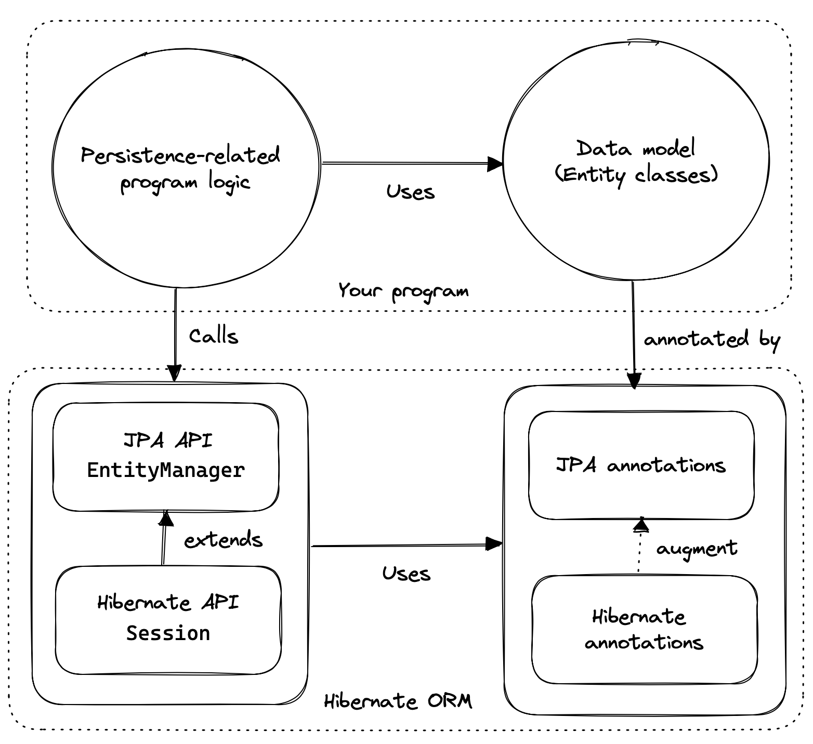
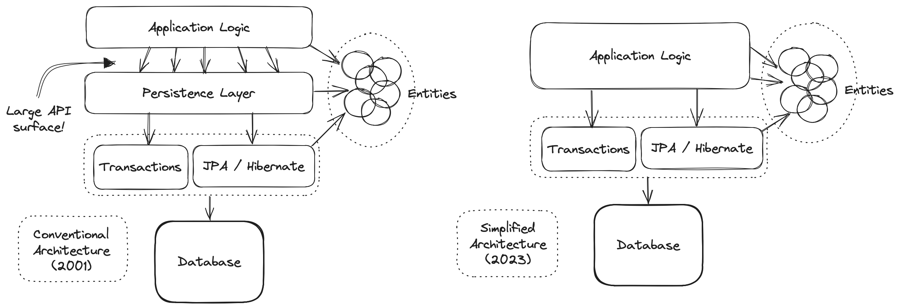

[[introduction]]
== Introduction

Hibernate is usually described as a library that makes it easy to map Java classes to relational database tables.
But this formulation does no justice to the central role played by the relational data itself.
So a better description might be:

****
Hibernate makes *relational data* visible to a program written in Java, in a *natural* and *typesafe* form,

1. making it easy to write complex queries and work with their results,
2. letting the program easily synchronize changes made in memory with the database, respecting the ACID properties of transactions, and
3. allowing performance optimizations to be made after the basic persistence logic has already been written.
****

Here the relational data is the focus, along with the importance of typesafety.
The goal of _object/relational mapping_ (ORM) is to eliminate fragile and untypesafe code, and make large programs easier to maintain in the long run.

ORM takes the pain out of persistence by relieving the developer of the need to hand-write tedious, repetitive, and fragile code for flattening graphs of objects to database tables and rebuilding graphs of objects from flat SQL query result sets.
Even better, ORM makes it much easier to tune performance later, after the basic persistence logic has already been written.

[TIP]
// .ORM or SQL?
====
A perennial question is: should I use ORM, or plain SQL?
The answer is usually: _use both_.
JPA and Hibernate were designed to work _in conjunction with_ handwritten SQL.
You see, most programs with nontrivial data access logic will benefit from the use of ORM at least _somewhere_.
But if Hibernate is making things more difficult, for some particularly tricky piece of data access logic, the only sensible thing to do is to use something better suited to the problem!
Just because you're using Hibernate for persistence doesn't mean you have to use it for _everything_.
====

Developers often ask about the relationship between Hibernate and JPA, so let's take a short detour into some history.

[[hibernate-and-jpa]]
=== Hibernate and JPA

Hibernate was the inspiration behind the _Java_ (now _Jakarta_) _Persistence API_, or JPA, and includes a complete implementation of the latest revision of this specification.

.The early history of Hibernate and JPA
****
The Hibernate project began in 2001, when Gavin King's frustration with Entity Beans in EJB 2 boiled over.
It quickly overtook other open source and commercial contenders to become the most popular persistence solution for Java, and the book _Hibernate in Action_, written with Christian Bauer, was an influential bestseller.

In 2004, Gavin and Christian joined a tiny startup called JBoss, and other early Hibernate contributors soon followed: Max Rydahl Andersen, Emmanuel Bernard, Steve Ebersole, and Sanne Grinovero.

Soon after, Gavin joined the EJB 3 expert group and convinced the group to deprecate Entity Beans in favor of a brand-new persistence API modelled after Hibernate.
Later, members of the TopLink team got involved, and the Java Persistence API evolved as a collaboration between—primarily—Sun, JBoss, Oracle, and Sybase, under the leadership of Linda Demichiel.

Over the intervening two decades, _many_ talented people have contributed to the development of Hibernate.
We're all especially grateful to Steve, who has led the project for many years, since Gavin stepped back to focus in other work.
****

We can think of the API of Hibernate in terms of three basic elements:

- an implementation of the JPA-defined APIs, most importantly, of the interfaces `EntityManagerFactory` and `EntityManager`, and of the JPA-defined O/R mapping annotations,
- a _native API_ exposing the full set of available functionality, centered around the interfaces link:{doc-javadoc-url}org/hibernate/SessionFactory.html[`SessionFactory`], which extends `EntityManagerFactory`, and link:{doc-javadoc-url}org/hibernate/Session.html[`Session`], which extends `EntityManager`, and
- a set of link:{doc-javadoc-url}org/hibernate/annotations/package-summary.html[_mapping annotations_] which augment the O/R mapping annotations defined by JPA, and which may be used with the JPA-defined interfaces, or with the native API.

Hibernate also offers a range of SPIs for frameworks and libraries which extend or integrate with Hibernate, but we're not interested in any of that stuff here.

As an application developer, you must decide whether to:

- write your program in terms of `Session` and `SessionFactory`, or
- maximize portability to other implementations of JPA by, wherever reasonable, writing code in terms of  `EntityManager` and `EntityManagerFactory`, falling back to the native APIs only where necessary.

Whichever path you take, you will use the JPA-defined mapping annotations most of the time, and the Hibernate-defined annotations for more advanced mapping problems.

[TIP]
// .Developing with "pure" JPA
====
You might wonder if it's possible to develop an application using _only_ JPA-defined APIs, and, indeed, that's possible in principle.
JPA is a great baseline that really nails the basics of the object/relational mapping problem.
But without the native APIs, and extended mapping annotations, you miss out on much of the power of Hibernate.
====

Since Hibernate existed before JPA, and since JPA was modelled on Hibernate, we unfortunately have some competition and duplication in naming between the standard and native APIs.
For example:

.Examples of competing APIs with similar naming
|===
| Hibernate | JPA

| `org.hibernate.annotations.CascadeType` | `javax.persistence.CascadeType`
| `org.hibernate.FlushMode` | `javax.persistence.FlushModeType`
| `org.hibernate.annotations.FetchMode` | `javax.persistence.FetchType`
| `org.hibernate.query.Query` | `javax.persistence.Query`
| `org.hibernate.Cache` | `javax.persistence.Cache`
| `@org.hibernate.annotations.NamedQuery` | `@javax.persistence.NamedQuery`
| `@org.hibernate.annotations.Cache` | `@javax.persistence.Cacheable`
|===

Typically, the Hibernate-native APIs offer something a little extra that's missing in JPA, so this isn't exactly a _flaw_.
But it's something to watch out for.

[[java-code]]
=== Writing Java code with Hibernate

If you're completely new to Hibernate and JPA, you might already be wondering how the persistence-related code is structured.

Well, typically, our persistence-related code comes in two layers:

. a representation of our data model in Java, which takes the form of a set of annotated entity classes, and
. a larger number of functions which interact with Hibernate's APIs to perform the persistence operations associated with your various transactions.

The first part, the data or "domain" model, is usually easier to write, but doing a great and very clean job of it will strongly affect your success in the second part.

Most people implement the domain model as a set of what we used to call "Plain Old Java Objects", that is, as simple Java classes with no direct dependencies on technical infrastructure, nor on application logic which deals with request processing, transaction management, communications, or interaction with the database.

[TIP]
====
Take your time with this code, and try to produce a Java model that's as close as reasonable to the relational data model. Avoid using exotic or advanced mapping features when they're not really needed.
When in the slightest doubt, map a foreign key relationship using `@ManyToOne` with `@OneToMany(mappedBy=...)` in preference to more complicated association mappings.
====

The second part of the code is much trickier to get right. This code must:

- manage transactions and sessions,
- interact with the database via the Hibernate session,
- fetch and prepare data needed by the UI, and
- handle failures.

[TIP]
====
Responsibility for transaction and session management, and for recovery from certain kinds of failure, is best handled in some sort of framework code.
====

We're going to <<organizing-persistence,come back soon>> to the thorny question of how this persistence logic should be organized, and how it should fit into the rest of the system.
// First we want to make the ideas above concrete by seeing a simple example program that uses Hibernate in isolation.

[[hello-hibernate]]
=== Hello, Hibernate

Before we get deeper into the weeds, we'll quickly present a basic example program that will help you get started if you don't already have Hibernate integrated into your project.

We begin with a simple gradle build file:

[[build-gradle]]
[source,groovy,subs="attributes+"]
.`build.gradle`
----
plugins {
    id 'java'
}

group = 'org.example'
version = '1.0-SNAPSHOT'

repositories {
    mavenCentral()
}

dependencies {
    // the GOAT ORM
    implementation 'org.hibernate.orm:hibernate-core:{fullVersion}'

    // Hibernate Validator
    implementation 'org.hibernate.validator:hibernate-validator:8.0.0.Final'
    implementation 'org.glassfish:jakarta.el:4.0.2'

    // Agroal connection pool
    implementation 'org.hibernate.orm:hibernate-agroal:{fullVersion}'
    implementation 'io.agroal:agroal-pool:2.1'

    // logging via Log4j
    implementation 'org.apache.logging.log4j:log4j-core:2.20.0'

    // JPA Metamodel Generator
    annotationProcessor 'org.hibernate.orm:hibernate-jpamodelgen:{fullVersion}'

    // Compile-time checking for HQL
    //implementation 'org.hibernate:query-validator:2.0-SNAPSHOT'
    //annotationProcessor 'org.hibernate:query-validator:2.0-SNAPSHOT'

    // H2 database
    runtimeOnly 'com.h2database:h2:2.1.214'
}
----

Only the first of these dependencies is absolutely _required_ to run Hibernate.

Next, we'll add a logging configuration file for log4j:

[source,properties]
.`log4j2.properties`
----
rootLogger.level = info
rootLogger.appenderRefs = console
rootLogger.appenderRef.console.ref = console

logger.hibernate.name = org.hibernate.SQL
logger.hibernate.level = info

appender.console.name = console
appender.console.type = Console
appender.console.layout.type = PatternLayout
appender.console.layout.pattern = %highlight{[%p]} %m%n
----

Now we need some Java code.
We begin with our _entity class_:

[[book]]
[source,java]
.`Book.java`
----
package org.hibernate.example;

import jakarta.persistence.Entity;
import jakarta.persistence.Id;
import jakarta.validation.constraints.NotNull;

@Entity
class Book {
    @Id
    String isbn;

    @NotNull
    String title;

    Book() {}

    Book(String isbn, String title) {
        this.isbn = isbn;
        this.title = title;
    }
}
----

Finally, let's see code which configures and instantiates Hibernate and asks it to persist and query the entity.
Don't worry if this makes no sense at all right now.
It's the job of this Introduction to make all this crystal clear.

[[main-hibernate]]
[source,java]
.`Main.java`
----
package org.hibernate.example;

import org.hibernate.cfg.Configuration;

import static java.lang.Boolean.TRUE;
import static java.lang.System.out;
import static org.hibernate.cfg.AvailableSettings.*;

public class Main {
    public static void main(String[] args) {
        var sessionFactory = new Configuration()
                .addAnnotatedClass(Book.class)
                // use H2 in-memory database
                .setProperty(URL, "jdbc:h2:mem:db1")
                .setProperty(USER, "sa")
                .setProperty(PASS, "")
                // use Agroal connection pool
                .setProperty("hibernate.agroal.maxSize", 20)
                // display SQL in console
                .setProperty(SHOW_SQL, true)
                .setProperty(FORMAT_SQL, true)
                .setProperty(HIGHLIGHT_SQL, true)
                .buildSessionFactory();

        // export the inferred database schema
        sessionFactory.getSchemaManager().exportMappedObjects(true);

        // persist an entity
        sessionFactory.inTransaction(session -> {
            session.persist(new Book("9781932394153", "Hibernate in Action"));
        });

        // query data using HQL
        sessionFactory.inSession(session -> {
            out.println(session.createSelectionQuery("select isbn||': '||title from Book").getSingleResult());
        });

        // query data using criteria API
        sessionFactory.inSession(session -> {
            var builder = sessionFactory.getCriteriaBuilder();
            var query = builder.createQuery(String.class);
            var book = query.from(Book.class);
            query.select(builder.concat(builder.concat(book.get(Book_.isbn), builder.literal(": ")),
                    book.get(Book_.title)));
            out.println(session.createSelectionQuery(query).getSingleResult());
        });
    }
}
----

Here we've used Hibernate's native APIs.
We could have used JPA-standard APIs to achieve the same thing.

[[hello-jpa]]
=== Hello, JPA

If we limit ourselves to the use of JPA-standard APIs, we need to use XML to configure Hibernate.

[source,xml]
.`META-INF/persistence.xml`
----
<persistence xmlns="https://jakarta.ee/xml/ns/persistence"
             xmlns:xsi="http://www.w3.org/2001/XMLSchema-instance"
             xsi:schemaLocation="https://jakarta.ee/xml/ns/persistence https://jakarta.ee/xml/ns/persistence/persistence_3_0.xsd"
             version="3.0">

    <persistence-unit name="example">

        <class>org.hibernate.example.Book</class>

        <properties>

            <!-- H2 in-memory database -->
            <property name="jakarta.persistence.jdbc.url"
                      value="jdbc:h2:mem:db1"/>

            <!-- Credentials -->
            <property name="jakarta.persistence.jdbc.user"
                      value="sa"/>
            <property name="jakarta.persistence.jdbc.password"
                      value=""/>

            <!-- Agroal connection pool -->
            <property name="hibernate.agroal.maxSize"
                      value="20"/>

            <!-- display SQL in console -->
            <property name="hibernate.show_sql" value="true"/>
            <property name="hibernate.format_sql" value="true"/>
            <property name="hibernate.highlight_sql" value="true"/>

        </properties>

    </persistence-unit>
</persistence>
----

Note that our `build.gradle` and `log4j2.properties` files are unchanged.

Our entity class is also unchanged from what we had before.

Unfortunately, JPA doesn't offer an `inSession()` method, so we'll have to implement session and transaction management ourselves.
We can put that logic in our own `inSession()` function, so that we don't have to repeat it for every transaction.
Again, you don't need to understand any of this code right now.

[[main-jpa]]
[source,java]
.`Main.java` (JPA version)
----
package org.hibernate.example;

import jakarta.persistence.EntityManager;
import jakarta.persistence.EntityManagerFactory;

import java.util.Map;
import java.util.function.Consumer;

import static jakarta.persistence.Persistence.createEntityManagerFactory;
import static java.lang.System.out;
import static org.hibernate.cfg.AvailableSettings.JAKARTA_HBM2DDL_DATABASE_ACTION;
import static org.hibernate.tool.schema.Action.CREATE;

public class Main {
    public static void main(String[] args) {
        var factory = createEntityManagerFactory("example",
                // export the inferred database schema
                Map.of(JAKARTA_HBM2DDL_DATABASE_ACTION, CREATE));

        // persist an entity
        inSession(factory, entityManager -> {
            entityManager.persist(new Book("9781932394153", "Hibernate in Action"));
        });

        // query data using HQL
        inSession(factory, entityManager -> {
            out.println(entityManager.createQuery("select isbn||': '||title from Book").getSingleResult());
        });

        // query data using criteria API
        inSession(factory, entityManager -> {
            var builder = factory.getCriteriaBuilder();
            var query = builder.createQuery(String.class);
            var book = query.from(Book.class);
            query.select(builder.concat(builder.concat(book.get(Book_.isbn), builder.literal(": ")),
                    book.get(Book_.title)));
            out.println(entityManager.createQuery(query).getSingleResult());
        });
    }

    // do some work in a session, performing correct transaction management
    static void inSession(EntityManagerFactory factory, Consumer<EntityManager> work) {
        var entityManager = factory.createEntityManager();
        var transaction = entityManager.getTransaction();
        try {
            transaction.begin();
            work.accept(entityManager);
            transaction.commit();
        }
        catch (Exception e) {
            if (transaction.isActive()) transaction.rollback();
            throw e;
        }
        finally {
            entityManager.close();
        }
    }
}
----

In practice, we never access the database directly from a `main()` method.
So now let's talk about how to organize persistence logic in a real system.
The rest of this chapter is not compulsory.
If you're itching for more details about Hibernate itself, you're quite welcome to skip straight to the <<entities,next chapter>>, and come back later.

[[organizing-persistence]]
=== Organizing persistence logic

In a real program, persistence logic like the code shown above is usually interleaved with other sorts of code, including logic:

- implementing the rules of the business domain, or
- for interacting with the user.

Therefore, many developers quickly—even _too quickly_, in our opinion—reach for ways to isolate the persistence logic into some sort of separate architectural layer.
We're going to ask you to suppress this urge for now.

[TIP]
====
The _easiest_ way to use Hibernate is to call the `Session` or `EntityManager` directly.
If you're new to Hibernate, frameworks which wrap JPA are only going to make your life more difficult.
====

We prefer a _bottom-up_ approach to organizing our code.
We like to start thinking about methods and functions, not about architectural layers and container-managed objects.
To illustrate the sort of approach to code organization that we advocate, let's consider a service which queries the database using HQL or SQL.

We might start with something like this, a mix of UI and persistence logic:

[source,java]
----
@Path("/") @Produces("application/json")
public class BookResource {
    @GET @Path("book/{isbn}")
    public Book getBook(String isbn) {
        var book = sessionFactory.fromTransaction(session -> session.find(Book.class, isbn));
        return book == null ? Response.status(404).build() : book;
    }
}
----
Indeed, we might also _finish_ with something like that—it's quite hard to identify anything concretely wrong with the code above, and for such a simple case it seems really difficult to justify making this code more complicated by introducing additional objects.

One very nice aspect of this code, which we wish to draw your attention to, is that session and transaction management is handled by generic "framework" code, just as we already recommended above.
In this case, we're using the link:{doc-javadoc-url}org/hibernate/SessionFactory.html#fromTransaction(java.util.function.Function)[`fromTransaction()`] method, which happens to come built in to Hibernate.
But you might prefer to use something else, for example:

- in a container environment like Jakarta EE or Quarkus, _container-managed transactions_ and _container-managed persistence contexts_, or
- something you write yourself.

The important thing is that calls like `createEntityManager()` and `getTransaction().begin()` don't belong in regular program logic, because it's tricky and tedious to get the error handling correct.

Let's now consider a slightly more complicated case.

[source,java]
----
@Path("/") @Produces("application/json")
public class BookResource {
    private static final RESULTS_PER_PAGE = 20;

    @GET @Path("books/{titlePattern}/{page:\\d+}")
    public List<Book> findBooks(String titlePattern, int page) {
        var books = sessionFactory.fromTransaction(session -> {
            return session.createSelectionQuery("from Book where title like ?1 order by title", Book.class)
                    .setParameter(1, titlePattern)
                    .setPage(Page.page(RESULTS_PER_PAGE, page))
                    .getResultList();
        });
        return books.isEmpty() ? Response.status(404).build() : books;
    }

}
----

This is fine, and we won't complain if you prefer to leave the code exactly as it appears above.
But there's one thing we could perhaps improve.
We love super-short methods with single responsibilities, and there looks to be an opportunity to introduce one here.
Let's hit the code with our favorite thing, the Extract Method refactoring. We obtain:

[source,java]
----
static List<Book> findBooksByTitleWithPagination(Session session,
                                                 String titlePattern, Page page) {
    return session.createSelectionQuery("from Book where title like ?1 order by title", Book.class)
            .setParameter(1, titlePattern)
            .setPage(page)
            .getResultList();
}
----

This is an example of a _query method_, a function which accepts arguments to the parameters of a HQL or SQL query, and executes the query, returning its results to the caller.
And that's all it does; it doesn't orchestrate additional program logic, and it doesn't perform transaction or session management.

It's even better to specify the query string using the `@NamedQuery` annotation, so that Hibernate can validate the query it at startup time, that is, when the `SessionFactory` is created, instead of when the query is first executed.
Indeed, since we included the <<metamodel-generator,Metamodel Generator>> in our <<build-gradle,Gradle build>>, the query can even be validated at _compile time_.

We need a place to put the annotation, so lets move our query method to a new class:

[source,java]
----
@CheckHQL // validate named queries at compile time
@NamedQuery(name="findBooksByTitle",
            query="from Book where title like :title order by title")
class Queries {

    static List<Book> findBooksByTitleWithPagination(Session session,
                                                     String titlePattern, Page page) {
        return session.createNamedQuery("findBooksByTitle", Book.class)
                .setParameter("title", titlePattern)
                .setPage(page)
                .getResultList();
    }
}
----

Notice that our query method doesn't attempt to hide the `EntityManager` from its clients.
Indeed, the client code is responsible for providing the `EntityManager` or `Session` to the query method.
This is a quite distinctive feature of our whole approach.

The client code may:

-  obtain an `EntityManager` or `Session` by calling `inTransaction()` or `fromTransaction()`, as we saw above, or,
- in an environment with container-managed transactions, it might obtain it via dependency injection.

Whatever the case, the code which orchestrates a unit of work usually just calls the `Session` or `EntityManager` directly, passing it along to helper methods like our query method if necessary.

[source,java]
----
@GET
@Path("books/{titlePattern}/{page:\\d+}")
public List<Book> findBooks(String titlePattern, int page) {
    var books = sessionFactory.fromTransaction(session ->
            Queries.findBooksByTitleWithPagination(session, titlePattern,
                    Page.page(RESULTS_PER_PAGE, page));
    return books.isEmpty() ? Response.status(404).build() : books;
}
----

You might be thinking that our query method looks a bit boilerplatey.
That's true, perhaps, but we're much more concerned that it's not very typesafe.
Indeed, for many years, the lack of compile-time checking for HQL queries and code which binds arguments to query parameters was our number one source of discomfort with Hibernate.

Fortunately, there's now a solution to both problems: as an incubating feature of Hibernate 6.3, we now offer the possibility to have the Metamodel Generator fill in the implementation of such query methods for you.
This facility is the topic of <<generator,a whole chapter of this introduction>>, so for now we'll just leave you with one simple example.

Suppose we simplify `Queries` to just the following:

[source,java]
----
interface Queries {
    @HQL("where title like :title order by title")
    List<Book> findBooksByTitleWithPagination(String title, Page page);
}
----

Then the Metamodel Generator automatically produces an implementation of the method annotated `@HQL` in a class named `Queries_`.
We can call it just like we called our handwritten version:

[source,java]
----
@GET
@Path("books/{titlePattern}/{page:\\d+}")
public List<Book> findBooks(String titlePattern, int page) {
    var books = sessionFactory.fromTransaction(session ->
            Queries_.findBooksByTitleWithPagination(session, titlePattern,
                    Page.page(RESULTS_PER_PAGE, page));
    return books.isEmpty() ? Response.status(404).build() : books;
}
----

In this case, the quantity of code eliminated is pretty trivial.
The real value is in improved type safety.
We now find out about errors in assignments of arguments to query parameters at compile time.

[NOTE]
====
At this point, we're certain you're full of doubts about this idea.
And quite rightly so.
We would love to answer your objections right here, but that will take us much too far off track.
So we ask you to file away these thoughts for now.
We promise to make it make sense when we <<generator,properly address this topic later>>.
And, after that, if you still don't like this approach, please understand that it's completely optional.
Nobody's going to come around to your house to force it down your throat.
====

Now that we have a rough picture of what our persistence logic might look like, it's natural to ask how we should test our code.

[[testing]]
=== Testing persistence logic

:h2: http://www.h2database.com

When we write tests for our persistence logic, we're going to need:

1. a database, with
2. an instance of the schema mapped by our persistent entities, and
3. a set of test data, in a well-defined state at the beginning of each test.

It might seem obvious that we should test against the same database system that we're going to use in production, and, indeed, we should certainly have at least _some_ tests for this configuration.
But on the other hand, tests which perform I/O are much slower than tests which don't, and most databases can't be set up to run in-process.

So, since most persistence logic written using Hibernate 6 is _extremely_ portable between databases, it often makes good sense to test against an in-memory Java database.
({h2}[H2] is the one we recommend.)

[CAUTION]
====
We do need to be careful here if our persistence code uses native SQL, or if it uses concurrency-management features like pessimistic locks.
====

Whether we're testing against our real database, or against an in-memory Java database, we'll need to export the schema at the beginning of a test suite.
We _usually_ do this when we create the Hibernate `SessionFactory` or JPA `EntityManager`, and so traditionally we've used a <<automatic-schema-export,configuration property>> for this.

The JPA-standard property is `jakarta.persistence.schema-generation.database.action`.
For example, if we're using `Configuration` to configure Hibernate, we could write:

[source,java]
----
configuration.setProperty(AvailableSettings.JAKARTA_HBM2DDL_DATABASE_ACTION,
                          Action.SPEC_ACTION_DROP_AND_CREATE);
----

Alternatively, in Hibernate 6, we may use the new link:{doc-javadoc-url}org/hibernate/relational/SchemaManager.html[`SchemaManager`] API to export the schema, just as we did <<main-hibernate,above>>.

[source,java]
----
sessionFactory.getSchemaManager().exportMappedObjects(true);
----

Since executing DDL statements is very slow on many databases, we don't want to do this before every test.
Instead, to ensure that each test begins with the test data in a well-defined state, we need to do two things before each test:

1. clean up any mess left behind by the previous test, and then
2. reinitialize the test data.

We may truncate all the tables, leaving an empty database schema, using the `SchemaManager`.

[source,java]
----
sessionFactory.getSchemaManager().truncateMappedObjects();
----

After truncating tables, we might need to initialize our test data.
We may specify test data in a SQL script, for example:

[[import.sql]]
[source,sql]
./import.sql
----
insert into Books (isbn, title) values ('9781932394153', 'Hibernate in Action')
insert into Books (isbn, title) values ('9781932394887', 'Java Persistence with Hibernate')
insert into Books (isbn, title) values ('9781617290459', 'Java Persistence with Hibernate, Second Edition')
----

If we name this file `import.sql`, and place it in the root classpath, that's all we need to do.

Otherwise, we need to specify the file in the <<automatic-schema-export,configuration property>> `jakarta.persistence.sql-load-script-source`.
If we're using `Configuration` to configure Hibernate, we could write:

[source,java]
----
configuration.setProperty(AvailableSettings.JAKARTA_HBM2DDL_LOAD_SCRIPT_SOURCE,
                          "/org/example/test-data.sql");
----

The SQL script will be executed every time `exportMappedObjects()` or `truncateMappedObjects()` is called.

[TIP]
====
There's another sort of mess a test can leave behind: cached data in the <<second-level-cache,second-level cache>>.
We recommend _disabling_ Hibernate's second-level cache for most sorts of testing.
Alternatively, if the second-level cache is not disabled, then before each test we should call:
[source,java]
----
sessionFactory.getCache().evictAllRegions();
----
====

Now, suppose you've followed our advice, and written your entities and query methods to minimize dependencies on "infrastructure", that is, on libraries other than JPA and Hibernate, on frameworks,  on container-managed objects, and even on bits of your own system which are hard to instantiate from scratch.
Then testing persistence logic is now straightforward!

You'll need to:

- bootstrap Hibernate and create a `SessionFactory` or `EntityManagerFactory` and the beginning of your test suite (we've already seen how to do that), and
- create a new `Session` or `EntityManager` inside each `@Test` method, using `inTransaction()`, for example.

Actually, some tests might require multiple sessions.
But be careful not to leak a session between different tests.

[TIP]
=====
Another important test we'll need is one which validates our <<object-relational-mapping,O/R mapping annotations>> against the actual database schema.
This is again the job of the schema management tooling, either:
[source,java]
----
configuration.setProperty(AvailableSettings.JAKARTA_HBM2DDL_DATABASE_ACTION,
                          Action.ACTION_VALIDATE);

----
Or:
[source,java]
----
sessionFactory.getSchemaManager().validateMappedObjects();
----
This "test" is one which many people like to run even in production, when the system starts up.
=====

[[architecture]]
=== Architecture and the persistence layer

Let's now consider a different approach to code organization, one we treat with suspicion.

[WARNING]
====
In this section, we're going to give you our _opinion_.
If you're only interested in facts, or if you prefer not to read things that might undermine the opinion you currently hold, please feel free to skip straight to the <<entities,next chapter>>.
====

Hibernate is an architecture-agnostic library, not a framework, and therefore integrates comfortably with a wide range of Java frameworks and containers.
Consistent with our place within the ecosystem, we've historically avoided giving out much advice on architecture.
This is a practice we're now perhaps inclined to regret, since the resulting vacuum has come to be filled with advice from people advocating architectures, design patterns, and extra frameworks which we suspect make Hibernate a bit less pleasant to use than it should be.

In particular, frameworks which wrap JPA seem to add bloat while subtracting some of the fine-grained control over data access that Hibernate works so hard to provide.
These frameworks don't expose the full feature set of Hibernate, and so the program is forced to work with a less powerful abstraction.

The stodgy, dogmatic, _conventional_ wisdom, which we hesitate to challenge for simple fear of pricking ourselves on the erect hackles that inevitably accompany such dogma-baiting is:

> Code which interacts with the database belongs in a separate _persistence layer_.

We lack the courage—perhaps even the conviction—to tell you categorically to _not_ follow this recommendation.
But we do ask you to consider the cost in boilerplate of any architectural layer, and whether the benefits this cost buys are really worth it in the context of your system.

To add a little background texture to this discussion, and at the risk of our Introduction degenerating into a rant at such an early stage, we're going ask you to humor us while talk a little more about ancient history.

[%unbreakable]
.An epic tale of DAOs and Repositories
****
Back in the dark days of Java EE 4, before the standardization of Hibernate, and subsequent ascendance of JPA in Java enterprise development, it was common to hand-code the messy JDBC interactions that Hibernate takes care of today.
In those terrible times, a pattern arose that we used to call _Data Access Objects_ (DAOs).
A DAO gave you a place to put all that nasty JDBC code, leaving the important program logic cleaner.

When Hibernate arrived suddenly on the scene in 2001, developers loved it.
But Hibernate implemented no specification, and many wished to reduce or at least _localize_ the dependence of their project logic on Hibernate.
An obvious solution was to keep the DAOs around, but to replace the JDBC code inside them with calls to the Hibernate `Session`.

We partly blame ourselves for what happened next.

Back in 2002 and 2003 this really seemed like a pretty reasonable thing to do.
In fact, we contributed to the popularity of this approach by recommending—or at least not discouraging—the use of DAOs in _Hibernate in Action_.
We hereby apologize for this mistake, and for taking much too long to recognize it.

Eventually, some folks came to believe that their DAOs shielded their program from depending in a hard way on ORM, allowing them to "swap out" Hibernate, and replace it with JDBC, or with something else.
In fact, this was never really true—there's quite a deep difference between the programming model of JDBC, where every interaction with the database is explicit and synchronous, and the programming model of stateful sessions in Hibernate, where updates are implicit, and SQL statements are executed asynchronously.

But then the whole landscape for persistence in Java changed in April 2006, when the final draft of JPA 1.0 was approved.
Java now had a standard way to do ORM, with multiple high-quality implementations of the standard API.
This was the end of the line for the DAOs, right?

Well, no.
It wasn't.
DAOs were rebranded "repositories", and continue to enjoy a sort-of zombie afterlife as a front-end to JPA.
But are they really pulling their weight, or are they just unnecessary extra complexity and bloat? An extra layer of indirection that makes stack traces harder to read and code harder to debug?

Our considered view is that they're mostly just bloat.
The JPA `EntityManager` is a "repository", and it's a standard repository with a well-defined specification written by people who spend all day thinking about persistence.
If these repository frameworks offered anything actually _useful_—and not obviously foot-shooty—over and above what `EntityManager` provides, we would have already added it to `EntityManager` decades ago.
****

Ultimately, we're not sure you need a separate persistence layer at all.
At least _consider_ the possibility that it might be OK to call the `EntityManager` directly from your business logic.

We can already hear you hissing at our heresy.
But before slamming shut the lid of your laptop and heading off to fetch garlic and a pitchfork, take a couple of hours to weigh what we're proposing.

OK, so, look, if it makes you feel better, one way to view `EntityManager` is to think of it as a single _generic_ "repository" that works for every entity in your system.
From this point of view, JPA _is_ your persistence layer.
And there's few good reasons to wrap this abstraction in a second abstraction that's _less_ generic.

// We might even analogize `EntityManager` to `List`.
// Then DAO-style repositories would be like having separate `StringList`, `IntList`, `PersonList`, and `BookList` classes.
// They're a parallel class hierarchy that makes the data model harder to evolve over time.

// Of course, such decisions are highly context-dependent: surely _some_ programs out there really do benefit from isolating the persistence logic into some sort of distinct layer; on the other hand, we're equally sure that there are others which simply _don't_.

Even where a distinct persistence layer _is_ appropriate, DAO-style repositories aren't the unambiguously most-correct way to factorize the equation:

- most nontrivial queries touch multiple entities, and so it's often quite ambiguous which repository such a query belongs to,
- most queries are extremely specific to a particular fragment of program logic, and aren't reused in different places across the system, and
- the various operations of a repository rarely interact or share common internal implementation details.

Indeed, repositories, by nature, exhibit very low _cohesion_.
A layer of repository objects might make sense if you have multiple implementations of each repository, but in practice almost nobody ever does.
That's because they're also extremely highly _coupled_ to their clients, with a very large API surface.
And, on the contrary, a layer is only easily replaceable if it has a very _narrow_ API.

[%unbreakable]
[TIP]
====
Some people do indeed use mock repositories for testing, but we really struggle to see any value in this.
If we don't want to run our tests against our real database, it's usually very easy to "mock" the database itself by running tests against an in-memory Java database like H2.
This works even better in Hibernate 6 than in older versions of Hibernate, since HQL is now _much_ more portable between platforms.
====

// So even in cases where separation _is_ of benefit, we go on to question the notion that this must be achieved via a layer of container-managed objects.

// That said, one thing we _do_ understand is the desire to package:
//
// - a HQL or SQL query string with
// - the code which binds its parameters
//
// as a typesafe function.
// DAO-style repositories seem to provide a very natural place to hang such functions, and we suspect that this accounts for at least some of their continued popularity.
// You're probably wondering how _we_ would go about defining such functions.

// One thing that some repository frameworks offer is the ability to declare an abstract method that queries the database, and have the framework fill in an implementation of the method.
// But the way this works is that you must encode your query into the name of the method itself.
//
// Which, at least in principle, for a not-very-complicated query, leads to a method name like this:
//
// [.text-center]
// `findFirst10ByOrderDistinctPeopleByLastnameOrFirstnameAsc`
//
// This is a much worse query language than HQL.
// I think you can see why we didn't implement this idea in Hibernate.
//
_Phew_, let's move on.

[[overview]]
=== Overview

It's now time to begin our journey toward actually _understanding_ the code we saw earlier.

This introduction will guide you through the basic tasks involved in developing a program that uses Hibernate for persistence:

1. configuring and bootstrapping Hibernate, and obtaining an instance of `SessionFactory` or `EntityManagerFactory`,
2. writing a _domain model_, that is, a set of _entity classes_ which represent the persistent types in your program, and which map to tables of your database,
3. customizing these mappings when the model maps to a pre-existing relational schema,
4. using the `Session` or `EntityManager` to perform operations which query the database and return entity instances, or which update the data held in the database,
5. using the Hibernate Metamodel Generator to improve compile-time type-safety,
6. writing complex queries using the Hibernate Query Language (HQL) or native SQL, and, finally
7. tuning performance of the data access logic.

Naturally, we'll start at the top of this list, with the least-interesting topic: _configuration_.
