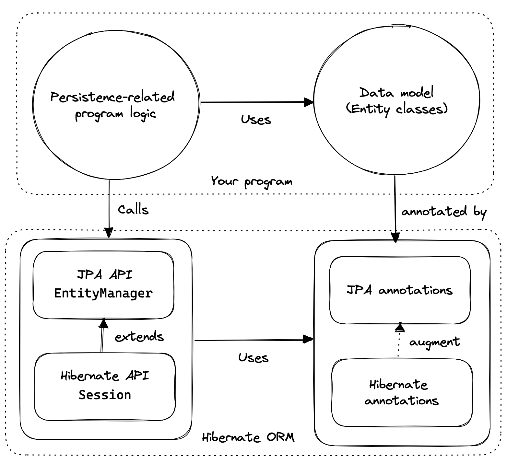

[[introduction]]
== Introduction

:persistence: https://jakarta.ee/specifications/persistence/4.0/jakarta-persistence-spec-4.0-M4.pdf
:data: https://jakarta.ee/specifications/data/1.1/jakarta-data-1.1-m3.pdf
:query: https://jakarta.ee/specifications/query/1.0/jakarta-query-1.0-m2.pdf

Hibernate is usually described as a library that makes it easy to map Java classes to relational database tables.
But this formulation does no justice to the central role played by the relational data itself.
So a better description might be:

****
Hibernate makes *relational data* visible to a program written in Java, in a *natural* and *typesafe* form,

1. making it easy to write complex queries and work with their results,
2. letting the program easily synchronize changes made in memory with the database, respecting the ACID properties of transactions,
3. automatically handling concerns like temporal data, audit logging, multi-tenancy, and row-level security, and
4. allowing performance optimizations to be made after the basic persistence logic has already been written.
****

Here the relational data is the focus, along with the importance of type safety.
The goal of _object/relational mapping_ (ORM) is to eliminate fragile and untypesafe code, and make large programs easier to maintain in the long run.

ORM takes the pain out of persistence by relieving the developer of the need to hand-write tedious, repetitive, and fragile code for flattening graphs of objects to database tables and rebuilding graphs of objects from flat SQL query result sets.
Even better, ORM makes it much easier to tune performance later, after the basic persistence logic has already been written.

Actually, the problem that object/relational mapping solves has been mischaracterized for decades, and has very little to do with any so-called "mismatch" between classes and tables. The real problem is:

1. Data is stored in **normalized tables**.
2. The process of efficiently reading data from tables **<<join-fetch,denormalizes the data with joins>>**.
3. In an object-oriented program, we often want to work with data in something quite close to its **original normalized form**.

Therefore, the principal task of object/relational mapping is to _renormalize the data after reading it from the database_. This need exists even if the classes in our program are identical to the database tables.

[TIP]
// .ORM or SQL?
====
A perennial question is: should I use ORM, or plain SQL?
The answer is usually: _use both_.
JPA and Hibernate were designed to work _in conjunction with_ handwritten SQL.
You see, most programs with nontrivial data access logic will benefit from the use of ORM at least _somewhere_.
But if Hibernate is making things more difficult, for some particularly tricky piece of data access logic, the only sensible thing to do is to use something better suited to the problem!
Just because you're using Hibernate for persistence doesn't mean you have to use it for _everything_.
====

Let's underline the important point here: the goal of ORM is _not_ to hide SQL or the relational model.
After all, Hibernate's query language is link:{doc-query-language-url}[nothing more than an object-oriented dialect of ANSI SQL].
On the other hand, Hibernate does help smooth over many of the differences between relational databases and SQL dialects.

.*Read more: Is Hibernate a leaky abstraction?*
[%collapsible]
====
****
Hibernate--and ORM in general--has been accused of being a _leaky abstraction_, that is, of failing to completely hide the underlying relational database.
Is this true?

Well, as you can guess from what we've already said, the short answer is: yes, _and that's a good thing._

Of course, whether you consider an abstraction "leaky" depends on what you think it's trying to abstract.
Hibernate successfully abstracts many things: variations between dialects of SQL, messy interactions with JDBC, SQL object naming conventions, and so on.
But it doesn't even attempt to pretend there's anything other than a relational data model underlying all this.
The simple reason is performance. It's just not possible to <<tuning-and-performance,achieve acceptable performance>> in data access without acknowledging the nature of the underlying persistent representation.
We're old enough to have seen multiple generations of developer relearn this lesson by experience.
****
====

Developers often ask about the relationship between Hibernate and JPA, so let's bite that cookie first.

[[hibernate-and-jpa]]
=== Hibernate and JPA

Hibernate was the inspiration behind the _Java_ (now _Jakarta_) _Persistence API_, or JPA, and includes a complete implementation of the latest revision of link:{persistence}[this specification].
In recent years, the Hibernate team has led the efforts to modernize the Jakarta EE persistence specifications, culminating in the release of this three-headed hellhound: Persistence 4.0, Query 1.0, and Data 1.1.

[[history]]
.*Read more: The early history of Hibernate and JPA*
[%collapsible]
====
****
The Hibernate project began in 2001, when Gavin King's frustration with Entity Beans in EJB 2 boiled over.
It quickly overtook other open source and commercial contenders to become the most popular persistence solution for Java, and the book _Hibernate in Action_, written with Christian Bauer, was an influential bestseller.

In 2004, Gavin and Christian joined a tiny startup called JBoss, and other early Hibernate contributors soon followed: Max Rydahl Andersen, Emmanuel Bernard, Steve Ebersole, and Sanne Grinovero.

Soon after, Gavin joined the EJB 3 expert group and convinced the group to deprecate Entity Beans in favor of a brand-new persistence API modelled after Hibernate.
Later, members of the TopLink team got involved, and the Java Persistence API evolved as a collaboration between—primarily—Sun, JBoss, Oracle, and Sybase, under the leadership of Linda Demichiel.

Over the intervening two decades, _many_ talented people have contributed to the development of Hibernate.
We're all especially grateful to Steve, who has led the project for many years, since Gavin stepped back to focus on other work.
****
====

We can think of Hibernate in terms of four basic elements:

- an implementation of the JPA-defined APIs, most importantly, of the interfaces `EntityManagerFactory`, `EntityAgent`, and `EntityManager`, and of the JPA-defined O/R mapping annotations,
- a _native API_ exposing the full set of available functionality, centered around the interfaces link:{doc-javadoc-url}org/hibernate/SessionFactory.html[`SessionFactory`], which extends `EntityManagerFactory`,
link:{doc-javadoc-url}org/hibernate/StatelessSession.html[`StatelessSession`], which extends `EntityAgent`, and link:{doc-javadoc-url}org/hibernate/Session.html[`Session`], which extends `EntityManager`,
- a set of link:{doc-javadoc-url}org/hibernate/annotations/package-summary.html[_mapping annotations_] which augment the O/R mapping annotations defined by JPA, and which may be used with the JPA-defined interfaces, or with the native API, and
- finally, <<metamodel-generator,Hibernate Processor>>, which is responsible for generating the _static metamodel_ and implementations of Jakarta Data repositories.

Hibernate also offers a range of SPIs for frameworks and libraries which extend or integrate with Hibernate, but we're not interested in any of that stuff here.

Before JPA 4, many teams chose to write their program in terms of `Session` and `SessionFactory`, to take advantage of the larger feature set accessible via these APIs.
Other teams chose to maximize portability to other implementations of JPA by, wherever reasonable, writing code in terms of  `EntityManager` and `EntityManagerFactory`, falling back to the native APIs only where necessary.
JPA 4 tips the balance quite far in favor of the standard JPA APIs.

[IMPORTANT]
As of Jakarta Persistence 4.0, we feel that there's no longer much advantage to be had from the direct use of `Session` and `SessionFactory`, at least not most of the time.
New code can be written in terms of the standard `EntityManager` and `EntityManagerFactory` interfaces, and a broad range of Hibernate-specific extensions are made available as JPA _option objects_.

Whichever path you take, you will use the JPA-defined mapping annotations most of the time, and the Hibernate-defined annotations for more advanced mapping problems.

You might wonder if it's possible to develop an application using _only_ JPA-defined APIs, and, indeed, that's possible in principle.
JPA is a great baseline that really nails the basics of the object/relational mapping problem.
But without the extended mapping annotations, and without the occasional use of Hibernate-specific option objects, you miss out on much of the power of Hibernate.

Since Hibernate existed before JPA, and since JPA was modelled on Hibernate, we unfortunately have some competition and duplication in naming between the standard and native APIs.
For example:

.Examples of competing APIs with similar naming
|===
| Hibernate | JPA

| `org.hibernate.FlushMode` | `javax.persistence.FlushModeType`
| `org.hibernate.annotations.FetchMode` | `javax.persistence.FetchType`
| `@org.hibernate.annotations.Fetch` | `@jakarta.persistence.Fetch`
| `org.hibernate.query.Query` | `javax.persistence.Query`
| `org.hibernate.Cache` | `javax.persistence.Cache`
| `@org.hibernate.annotations.NamedQuery` | `@javax.persistence.NamedQuery`
| `@org.hibernate.annotations.Cache` | `@javax.persistence.Cacheable`
| `org.hibernate.relational.SchemaManager` | `jakarta.persistence.SchemaManager`
|===

Typically, the Hibernate-native APIs offer something a little extra that's missing in JPA, so this isn't exactly a _flaw_.
But it's something to watch out for.

[[hello-hibernate]]
=== Hello, Hibernate

Before we get deeper into the weeds, we'll quickly present a basic example program that will help you get started if you don't already have Hibernate integrated into your project.

We begin with a simple https://gradle.org[Gradle] build file:

[[build-gradle]]
[source,groovy,subs="attributes+"]
.`build.gradle`
----
plugins {
    id 'java'
}

group = 'org.example'
version = '1.0-SNAPSHOT'

repositories {
    mavenCentral()
}

dependencies {
    // the GOAT ORM (required)
    implementation 'org.hibernate.orm:hibernate-core:{fullVersion}'

    // Hibernate Processor (strongly recommended)
    annotationProcessor 'org.hibernate.orm:hibernate-processor:{fullVersion}'

    // Jakarta Data support (optional)
    implementation 'jakarta.data:jakarta.data-api:1.1.0-M3'
    implementation 'jakarta.data:jakarta.data-stateful:1.1.0-M3'

    // Hibernate Validator (optional)
    implementation 'org.hibernate.validator:hibernate-validator:9.0.1.Final'
    implementation 'org.glassfish.expressly:expressly:6.0.0'

    // Agroal connection pool (optional)
    runtimeOnly 'org.hibernate.orm:hibernate-agroal:{fullVersion}'

    // logging via Log4j (recommended)
    runtimeOnly 'org.apache.logging.log4j:log4j-core:2.26.0'

    // H2 database (or JDBC driver of choice)
    runtimeOnly 'com.h2database:h2:2.4.240'
}
----

Only the first of these dependencies is absolutely _required_ to run Hibernate.

Next, we'll add a logging configuration file for https://logging.apache.org/log4j/[log4j]:

[source,properties]
.`log4j2.properties`
----
rootLogger.level = info
rootLogger.appenderRefs = console
rootLogger.appenderRef.console.ref = console

# SQL statements (set level=debug to enable)
logger.hibernate.name = org.hibernate.SQL
logger.hibernate.level = info
# JDBC parameter binding (set level=trace to enable)
logger.jdbc-bind.name=org.hibernate.orm.jdbc.bind
logger.jdbc-bind.level=info
# JDBC result set extraction (set level=trace to enable)
logger.jdbc-extract.name=org.hibernate.orm.jdbc.extract
logger.jdbc-extract.level=info
# JDBC batching (set level=trace to enable)
logger.batch.name=org.hibernate.orm.jdbc.batch
logger.batch.level=info

# direct log output to the console
appender.console.name = console
appender.console.type = Console
appender.console.layout.type = PatternLayout
appender.console.layout.pattern = %highlight{[%p]} %m%n
----

Now we need some Java code.
We begin with our <<domain-model,_entity class_>>:

[[book]]
[source,java]
.`Book.java`
----
package org.hibernate.example;

import jakarta.persistence.Entity;
import jakarta.persistence.Id;
import jakarta.validation.constraints.NotNull;

@Entity
class Book {
    @Id
    String isbn;

    @NotNull
    String title;

    Book() {}

    Book(String isbn, String title) {
        this.isbn = isbn;
        this.title = title;
    }
}
----

Finally, let's see code which <<configuration,configures>> and instantiates Hibernate and asks it to <<interacting,persist and query>> the entity.
Don't worry if this makes no sense at all right now.
It's the job of the rest of this guide to make all this crystal clear as we go along.

[[main-hibernate]]
[source,java]
.`Main.java`
----
import org.hibernate.example.*;
import jakarta.persistence.EntityManagerFactory;
import jakarta.persistence.FetchType;
import jakarta.persistence.PersistenceConfiguration;

import static java.lang.System.out;
import static jakarta.persistence.SchemaManagementAction.CREATE;
import static jakarta.persistence.PersistenceConfiguration.*;
import static org.hibernate.cfg.JdbcSettings.*;

EntityManagerFactory factory =
        new PersistenceConfiguration("Bookshelf")
                // all associations should be lazy by default
                .defaultToOneFetchType(FetchType.LAZY)
                // register the entity class
                .managedClass(Book.class)
                // use H2 in-memory database
                .property(JDBC_URL, "jdbc:h2:mem:db1")
                .property(JDBC_USER, "sa")
                .property(JDBC_PASSWORD, "")
                // set the Agroal connection pool size
                .property(POOL_SIZE, 16)
                // display SQL in console
                .property(SHOW_SQL, true)
                .property(FORMAT_SQL, true)
                .property(HIGHLIGHT_SQL, true)
                // export the inferred database schema
                .schemaManagementDatabaseAction(CREATE)
                // start Hibernate
                .createEntityManagerFactory();

void main() {
    // persist an entity
    factory.runInTransaction(manager -> {
        manager.persist(new Book("9781932394153", "Hibernate in Action"));
    });

    // query data using HQL
    factory.runInTransaction(manager -> {
        manager.createQuery("select isbn || ': ' || title from Book")
                .ofType(String.class)
                .getResultList()
                .forEach(out::println);
    });

    // query data using criteria API
    factory.runInTransaction(manager -> {
        var builder = factory.getCriteriaBuilder();
        var query = builder.createQuery(String.class);
        var book = query.from(Book.class);
        query.select(builder.concat(
                List.of(book.get(Book_.isbn),
                        builder.literal(": "),
                        book.get(Book_.title))));
        manager.createQuery(query)
                .getResultList()
                .forEach(out::println);
    });
}
----

This code introduces two very central interfaces:

- the `EntityManagerFactory`, which in Hibernate is also an instance of link:{doc-javadoc-url}org/hibernate/SessionFactory.html[`SessionFactory`], and
- a mysterious `manager` object, which in JPA an instance of `EntityManager`, and in Hibernate is also an instance of link:{doc-javadoc-url}org/hibernate/Session.html[`Session`].

In this guide, we call each instance of `EntityManager` a _session_.

In practice, we never access the database directly from a `main()` method.
// So now let's now return to the question of how to organize persistence logic in a real system.

[[java-code]]
=== Writing Java code with Hibernate

If you're completely new to Hibernate and JPA, you might already be wondering how the persistence-related code is structured.

Well, typically, our persistence-related code comes in two layers:

. a representation of our data model in Java, which takes the form of a set of annotated entity classes, and
. a larger number of functions which interact with Hibernate's APIs to perform the persistence operations associated with our various transactions.

The first part, the data or "domain" model, is usually easier to write, but doing a great and very clean job of it will strongly affect your success in the second part.

Most people implement the domain model as a set of what we used to call "Plain Old Java Objects", that is, as simple Java classes with no direct dependencies on technical infrastructure, nor on application logic which deals with request processing, transaction management, communications, or interaction with the database.

[TIP]
====
Take your time with this code, and try to produce a Java model that's as close as reasonable to the relational data model. Avoid using exotic or advanced mapping features when they're not really needed.
When in the slightest doubt, map a foreign key relationship using `@ManyToOne` with `@OneToMany(mappedBy=...)` in preference to more complicated association mappings.
====

The second part of the code is much trickier to get right. This code must:

- manage transactions and sessions,
- interact with the database via the Hibernate session,
- publish CDI events and send JMS messages,
- fetch and prepare data needed by the UI, and
- handle failures.

[TIP]
====
Responsibility for transaction and session management, and for recovery from certain kinds of failure, is best handled in some sort of framework code.
====

// [TIP]
// ====
// A great way to handle CDI event publication is via a <<callbacks,JPA entity listener>>.
// Whereas we would never want to inject a CDI https://jakarta.ee/specifications/cdi/3.0/apidocs/[event publisher] into an entity object, it's perfectly fine to inject them in an entity listener.
// ====

We're going to <<organizing-persistence,come back soon>> and describe one good way to organize persistence logic, but we will emphasize that it's not the only way.
First, let's talk about entities.

[[domain-model]]
=== Entities

A class in the domain model which directly represents a relational database table is called an <<entities,_entity_>>.
Entity classes are central to object persistence and to object/relational mapping.
They're also, typically, central players in the business logic of our application program.
Entities represent the _things_ in our business domain.
This makes them very important objects indeed!

Given how much weight an entity already bears due to its very nature, we need to think carefully before weighing it down with too many additional responsibilities.

[[entity-logic]]
.*Read more: Rich and anemic entities*
[%collapsible]
====
****
There exists an extensive online literature which posits that there are _rich domain models_, where entities have methods implementing interesting business logic, and _anemic domain models_, where the entities are pure data holders, and that a developer should hold an opinion that one or the other of these sorts of domain model is "better".

We do not hold any such opinion, and if you ask us for one, we will most likely suddenly discover somewhere else we need to be.

A more interesting question is not _how much_ logic belongs in the entity class, but _what sort_ of logic belongs there.
****
====

We think that an entity should never implement technical concerns, and should never obtain references to framework objects.
Nor should it hold extra mutable state which is not very directly related to its role in representing persistent state.
For example:

- an entity may compute totals and averages, even caching them if necessary, enforce its invariants, interact with and construct other entities, and so on, and its annotations express how it maps to database tables,
- but the entity should not call the `EntityManager` or a Jakarta Data repository, build a criteria query, send a JMS message, start a transaction, publish events to the CDI event bus, maintain a stateful queue of events to be published later, or anything of a similar nature.

One way to summarize this is:

> Entities do business logic; but they don't do orchestration.

Later, we'll discuss various ways to <<managing-transactions,manage transactions>>, <<callbacks,send event notifications>>, and <<organizing-persistence,query the database>>.
Such code will always be external to the entity itself.

[[active-record]]
.*Read more: Active Record*
[%collapsible]
====
****
The discussion above expresses our "traditional" approach--which lay behind the design of Hibernate, of JPA, and of Jakarta Data--where entity classes are plain Java objects without dependence on framework code.
An alternative approach is the Active Record pattern, as exemplified by link:https://quarkus.io/guides/hibernate-orm-panache[Panache].
In Active Record, entity types inherit framework objects, and persistence operations are located directly on the entities.
You can think of this as merging the roles of entity and DAO/Repository into a single object.

Active Record comes with both upsides and downsides, but we don't mean to exclude it from consideration.
We must therefore slightly modify the prescription we've given above: in an Active Record, it's obviously OK to access the `EntityManager` and perform other persistence-related operations, and we therefore expect our Active Record class to look somewhat more "technical" than a trad entity.

But the basic principle remains intact: an entity does not do orchestration, it does not manage transactions, it does not obtain references to _other_ sorts of framework object, and it does not hold mutable state unrelated to its persistent state.
****
====

From now on, we're going to assume that entities are implemented as plain Java classes.

An entity can't persist itself.
For that we need a session.

[[stateful-and-stateless-sessions]]
=== Stateful and stateless sessions

It should be very clear from the example code <<main-hibernate,above>>, that the session is also a very important object.
It exposes basic operations like `persist()` and `createQuery()`, and so it's our first port of call when we want to <<interacting,interact with the database>> via Hibernate.
In the code we just saw, we've used a _stateful session_.

Later, we'll learn about the idea of a <<persistence-contexts,_persistence context_>>.
Oversimplifying for now, you can think of it as a cache of data which has been read in the current transaction.
Thus, in the architecture of Hibernate, it's sometimes called the _first-level cache_.
Each stateful session -- that is, every JPA <<hibernate-and-jpa,`EntityManager`>> -- has its own persistence context.

But stateful sessions are not the only possibility.
The new JPA 4 `EntityAgent` interface offers a way to interact with Hibernate _without_ going through a persistence context.
In Hibernate, every `EntityAgent` is also an instance of the much older interface <<stateless-sessions,`StatelessSession`>>, and so we often call an instance of `EntityAgent` a _stateless session_.
The programming model for stateless sessions is somewhat different.

.*Read more: Stateless sessions*
[%collapsible]
====
****
Among our biggest regrets is that we didn't give enough love to `StatelessSession` twenty years ago.
Sure, a stateful session is in some sense more powerful, or at least more magical.
But with that magic comes a loss of direct control over persistence operations, and some traps for inexperienced users.
A significant minority of developers find working with a persistence context frustrating, and they would surely be better served by a stateless session.

// - We used to view `StatelessSession` as an API directed toward very specific usage patterns, in particular, batch processing of large numbers of entities.
// As a result, we left out certain functionality -- for example, use of the <<second-level-cache,second-level cache>> -- which didn't seem relevant to those use cases.
// This left `StatelessSession` lacking feature parity with `Session`, and it was a mistake.
// In Hibernate 7, we've fixed this mistake.
// A `StatelessSession` now offers essentially all the functionality of Hibernate except, naturally, the first-level cache.
//
// - Compounding our error, we left `StatelessSession` out of JPA.
// This meant that a large number of Hibernate users _didn't even realize this option existed._
// We promise to make sure there are stateless sessions in Jakarta Persistence 4.

So, finally, let us state for the record: we messed up here.
Hibernate is all about _object/relational mapping;_ persistence contexts are something extra.
They're like the salsa verde in a Mexican dish--delicious, but optional--not like the green curry in a bowl of kaeng khiao wan.
You don't have to use stateful sessions, and you're not doing anything wrong if you decide to use stateless sessions instead.
****
====

A key decision for any new project is which of these programming models to take as a baseline.
Fortunately, the two models aren't mutually exclusive.
This is a friendly competition, where the two APIs are designed to complement each other.
Even if we decide to use stateful ``EntityManager``s most of the time, we can still use an `EntityAgent` wherever it's more convenient.

=== Managing sessions and transactions

One very nice aspect of the code we <<main-hibernate,just saw>>, which we wish to draw your attention to, is that session and transaction management is handled by generic "framework" code, just as we already recommended above.

Later, we'll discuss the traps we can fall into when we write custom code to manage <<persistence-contexts,sessions>> and <<managing-transactions,transactions>>.
It's certainly not impossible to get these concerns right, but it's easy enough to get them wrong, especially if we starting getting too creative.
Since we know that you, dear reader, are nothing if not creative, we encourage you to let your container or framework take care of this stuff.

In our code, we used the <<managing-transactions,`runInTransaction()`>> method of `EntityManagerFactor`.
But you might prefer to use something else, for example:

- in a container environment like Jakarta EE or https://quarkus.io[Quarkus]https://xxx[,] _container-managed transactions_ and _container-managed persistence contexts_, or
- something you write yourself.

The important thing is that calls like `createEntityManager()` and `getTransaction().begin()` don't belong in regular program logic, because it's tricky and tedious to get the error handling correct.

[[organizing-persistence]]
=== Repositories

In a real program, persistence logic like the code shown above is usually interleaved with other sorts of code, including logic:

- implementing the rules of the business domain, or
- for interacting with the user.

Therefore, many developers quickly--even _too quickly_, in our opinion--reach for ways to isolate the persistence logic into some sort of separate architectural layer.
For decades, there was no clearly "best" way to implement a persistence layer based on Hibernate, and frameworks which intended to simplify life for the developer seemed to us to actually make things worse.
With link:{data}[Jakarta Data 1.1], as implemented by <<generator,Hibernate Processor>>, the situation has changed, and the easiest way to write a persistence layer is now very clear.

.*Read more: Why we changed our mind about repositories*
[%collapsible]
====
****
At the time we wrote _An Introduction to Hibernate 6_, we were frustrated with the limitations of popular frameworks which claimed to simplify the use of JPA by wrapping and hiding the `EntityManager`.
In our considered opinion, such frameworks typically made JPA harder to use, sometimes misleading users into misuse of the technology.

The birth of the Jakarta Data specification has obsoleted our arguments against repositories, along with the older frameworks which were the source of our frustration.
Jakarta Data--as realized by Hibernate Data Repositories--offers a clean but very flexible way to organize code, along with much better compile-time type safety, without getting in the way of direct use of the `EntityAgent` or `EntityManager`.

Unlike other repository frameworks, Hibernate Data Repositories offers something that plain JPA simply doesn’t have: full compile-time type safety for your queries. To learn more, please refer to link:{doc-data-repositories-url}[Introducing Hibernate Data Repositories].
****
====

For now, let's see how we could rewrite our <<main-hibernate,earlier code>> using a repository.

[[repository-hibernate]]
[source,java]
.`Library.java`
----
package org.hibernate.example;

import jakarta.data.repository.Query;
import jakarta.data.repository.Repository;
import jakarta.persistence.EntityAgent;

import java.util.List;

@Repository
public interface Library {
    // access to the underlying stateful session
    EntityManager manager();

    // persist a book via the session
    @Persist
    void persist(Book entity);

    // a query method with a generated implementation
    // the query is fully validated at compile time!
    @Query("select isbn || ': ' || title from Book")
    List<String> summaries();

    // a repository method implemented by hand
    default List<String> summariesByCriteria() {
        var builder = manager().getCriteriaBuilder();
        var query = builder.createQuery(String.class);
        var book = query.from(Book.class);
        query.select(builder.concat(
                List.of(book.get(Book_.isbn),
                        builder.literal(": "),
                        book.get(Book_.title))));
        return manager().createQuery(query)
                .getResultList();
    }
}
----

Notice that the `@Repository` programming model lets us freely choose between:

- implementing a repository method by hand, and calling the `EntityManager` or `EntityAgent` directly, or
- having the implementation generated for us.

We could simplify our <<main-hibernate,`main()`>> method as follows:

[source,java]
.`Main.java`
----
...

EntityManagerFactory factory =
        new PersistenceConfiguration("Bookshelf")
                // all associations should be lazy by default
                .defaultToOneFetchType(FetchType.LAZY)
                // register the entity class
                .managedClass(Book.class)
                // register the repository interface!
                .managedClass(Library.class)
                // use H2 in-memory database
                .property(JDBC_URL, "jdbc:h2:mem:db1")
                .property(JDBC_USER, "sa")
                .property(JDBC_PASSWORD, "")
                // set the Agroal connection pool size
                .property(POOL_SIZE, 16)
                // display SQL in console
                .property(SHOW_SQL, true)
                .property(FORMAT_SQL, true)
                .property(HIGHLIGHT_SQL, true)
                // export the inferred database schema
                .schemaManagementDatabaseAction(CREATE)
                // start Hibernate
                .createEntityManagerFactory();

void main() {
    // persist an entity
    factory.runInTransaction(manager -> {
        Library library = new _Library(manager);
        library.persist(new Book("9781932394153", "Hibernate in Action"));
    });

    // query data using HQL
    factory.runInTransaction(manager -> {
        Library library = new _Library(manager);
        library.summaries().forEach(out::println);
    });

    // query data using criteria API
    factory.runInTransaction(manager -> {
        Library library = new _Library(manager);
        library.summariesByCriteria().forEach(out::println);
    });
}
----

In a real system we would not directly instantiate the generated `_Library` repository implementation class.
Instead, we would obtain the `Library` via dependency injection.
In Quarkus, WildFly, or any Jakarta EE container, https://www.cdi-spec.org[CDI] takes care of injecting repository objects.

[source,java]
@Inject Library library;

[IMPORTANT]
Notice that we registered the repository interface with the persistence unit via `managedClass()`.
// If we had used `persistence.xml` to configure Hibernate, we would have listed it as a `<class>`.

Now that we have a rough picture of what our persistence logic might look like, it's natural to ask how we should test our code.

[[testing]]
=== Testing persistence logic

:h2: http://www.h2database.com

When we write tests for our persistence logic, we're going to need:

1. a database, with
2. an instance of the schema mapped by our persistent entities, and
3. a set of test data, in a well-defined state at the beginning of each test.

It might seem obvious that we should test against the same database system that we're going to use in production, and, indeed, we should certainly have at least _some_ tests for this configuration.
But on the other hand, tests which perform I/O are much slower than tests which don't, and most databases can't be set up to run in-process.

So, since most persistence logic written using Hibernate 6 is _extremely_ portable between databases, it often makes good sense to test against an in-memory Java database.
({h2}[H2] is the one we recommend.)

[CAUTION]
====
We do need to be careful here if our persistence code uses native SQL, or if it uses concurrency-management features like pessimistic locks.
====

Whether we're testing against our real database, or against an in-memory Java database, we'll need to export the schema at the beginning of a test suite.
We _usually_ do this when we create the `EntityManagerFactory`, and so traditionally we've used a <<automatic-schema-export,configuration property>> for this.
The JPA-standard property is `jakarta.persistence.schema-generation.database.action`.

But if we're using `PersistenceConfiguration` to configure Hibernate, we could write:

[source,java]
----
configuration.schemaManagementDatabaseAction(SchemaManagementAction.DROP_AND_CREATE);
----

Alternatively, we may use the link:{doc-javadoc-url}org/hibernate/relational/SchemaManager.html[`SchemaManager`] API to export the schema.
This option is especially convenient when writing tests.

[source,java]
----
factory.getSchemaManager().create(true);
----

Since executing DDL statements is very slow on many databases, we don't want to do this before every test.
Instead, to ensure that each test begins with the test data in a well-defined state, we need to do two things before each test:

1. clean up any mess left behind by the previous test, and then
2. reinitialize the test data.

We may truncate all the tables, leaving an empty database schema, using the `SchemaManager`.

[source,java]
----
factory.getSchemaManager().truncate();
----

After truncating tables, we might need to initialize our test data.
We may specify test data in a SQL script, for example:

[[import.sql]]
[source,sql]
./import.sql
----
insert into Books (isbn, title) values ('9781932394153', 'Hibernate in Action')
insert into Books (isbn, title) values ('9781932394887', 'Java Persistence with Hibernate')
insert into Books (isbn, title) values ('9781617290459', 'Java Persistence with Hibernate, Second Edition')
----

If we name this file `import.sql`, and place it in the root classpath, that's all we need to do.

Otherwise, we need to specify the file in the <<automatic-schema-export,configuration property>> `jakarta.persistence.sql-load-script-source`.
If we're using `PersistenceConfiguration` to configure Hibernate, we could write:

[source,java]
----
configuration.property(PersistenceConfiguration.SCHEMAGEN_LOAD_SCRIPT_SOURCE,
                       "/org/example/test-data.sql");
----

The SQL script is executed every time `create()`, `populate()`, or `truncate()` is called.

[TIP]
====
There's another sort of mess a test can leave behind: cached data in the <<second-level-cache,second-level cache>>.
We recommend _disabling_ Hibernate's second-level cache for most sorts of testing.
Alternatively, if the second-level cache is not disabled, then before each test we should call:
[source,java]
----
factory.getCache()
        .unwrap(org.hibernate.Cache.class)
        .evictAllRegions();
----
====

Now, suppose you've followed our advice, and written your entities and query methods to minimize dependencies on "infrastructure", that is, on libraries other than JPA and Hibernate, on frameworks,  on container-managed objects, and even on bits of your own system which are hard to instantiate from scratch.
Then testing persistence logic is now straightforward!

You'll need to:

- bootstrap Hibernate and create a `EntityManagerFactory` at the beginning of your test suite (we've already seen how to do that), and
- create a new `EntityManager` or `EntityAgent` inside each `@Test` method, using `inTransaction()`, for example.

Actually, some tests might require multiple sessions.
But be careful not to leak a session between different tests.

[TIP]
=====
Another important test we'll need is one which validates our <<object-relational-mapping,O/R mapping annotations>> against the actual database schema.
This is again the job of the schema management tooling, either:
[source,java]
----
configuration.schemaManagementDatabaseAction(SchemaManagementAction.VALIDATE);
----
Or:
[source,java]
----
factory.getSchemaManager().validate();
----
This "test" is one which many people like to run even in production, when the system starts up.
=====

[[overview]]
=== Overview

It's now time to begin our journey toward actually _understanding_ the code we saw earlier.

This introduction will guide you through the basic tasks involved in developing a program that uses Hibernate for persistence:

1. configuring and bootstrapping Hibernate, and obtaining an instance of `EntityManagerFactory`,
2. writing a _domain model_, that is, a set of _entity classes_ which represent the persistent types in your program, and which map to tables of your database,
3. customizing these mappings when the model maps to a pre-existing relational schema,
4. using the `EntityManager` or `EntityAgent` to perform operations which query the database and return entity instances, or which update the data held in the database,
5. using Hibernate Processor to improve compile-time type-safety,
6. writing complex queries using the Hibernate Query Language (HQL) or native SQL, and, finally
7. tuning performance of the data access logic.

Naturally, we'll start at the top of this list, with the least-interesting topic: _configuration_.
