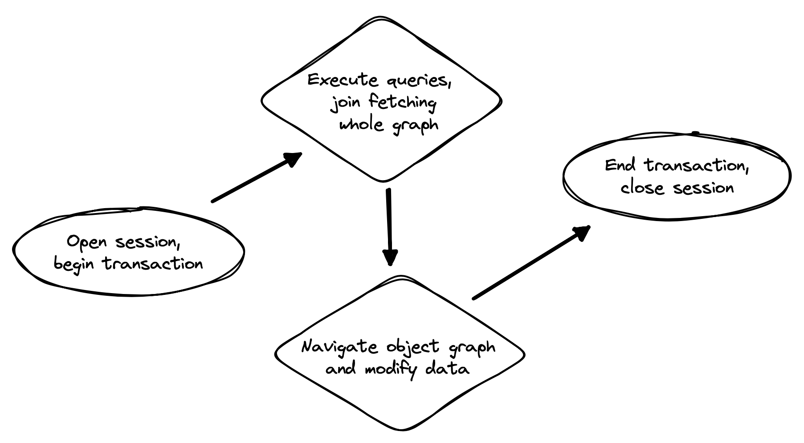

[[tuning-and-performance]]
== Tuning and performance

Once you have a program up and running using Hibernate to access
the database, it's inevitable that you'll find places where performance is
disappointing or unacceptable.

Fortunately, most performance problems are relatively easy to solve with
the tools that Hibernate makes available to you, as long as you keep a
couple of simple principles in mind.

First and most important: the reason you're using Hibernate is
that it makes things easier. If, for a certain problem, it's making
things _harder_, stop using it. Solve this problem with a different tool
instead.

IMPORTANT: Just because you're using Hibernate in your program doesn't mean
you have to use it _everywhere_.

Second: there are two main potential sources of performance bottlenecks in
a program that uses Hibernate:

- too many round trips to the database, and
- memory consumption associated with the first-level (session) cache.

So performance tuning primarily involves reducing the number of accesses
to the database, and/or controlling the size of the session cache.

But before we get to those more advanced topics, we should start by tuning
the connection pool.

[[connection-pool]]
=== Tuning the connection pool

The connection pool built in to Hibernate is suitable for testing, but isn't intended for use in production.
Instead, Hibernate supports several different connection pools, including our favorite, Agroal.

Hibernate will automatically make use of `AgroalConnectionProvider` if the module `org.hibernate.orm:hibernate-agroal` is available at runtime.
So just add it as a runtime dependency, and you're all set.

Well, actually, that's a bit fragile, since Hibernate silently falls back to using the default connection pool if Agroal happens to be missing at runtime.
Perhaps it's better to set this configuration property:

[%breakable,cols="37,~"]
|===
| Configuration property name | Purpose

| link:{doc-javadoc-url}/org/hibernate/cfg/JdbcSettings.html#CONNECTION_PROVIDER[`hibernate.connection.provider_class`] | Explicitly specify a link:{doc-javadoc-url}/org/hibernate/engine/jdbc/connections/spi/ConnectionProvider.html[connection pool], for example, `agroal`, `hikaricp` or `c3p0`.
|===

TIP: You can set `hibernate.connection.provider_class` to `agroal` so that Hibernate fails at startup if Agroal is missing.

To properly configure Agroal, you'll need to set some extra configuration properties, in addition to the settings we already saw in <<basic-configuration-settings>>.
Properties with the prefix `hibernate.agroal` are passed through to Agroal:

[source,properties]
----
# configure Agroal connection pool
hibernate.agroal.maxSize 20
hibernate.agroal.minSize 10
hibernate.agroal.acquisitionTimeout PT1s
hibernate.agroal.reapTimeout PT10s
----

There are many to choose from, as enumerated by link:{doc-javadoc-url}/org/hibernate/cfg/AgroalSettings.html[`AgroalSettings`]:

.Settings for configuring Agroal
[%breakable,cols="37,~"]
|===
| Configuration property name | Purpose

| `hibernate.agroal.maxSize` | The maximum number of connections present on the pool
| `hibernate.agroal.minSize` | The minimum number of connections present on the pool
| `hibernate.agroal.initialSize` | The number of connections added to the pool when it is started
| `hibernate.agroal.maxLifetime` | The maximum amount of time a connection can live, after which it is removed from the pool
| `hibernate.agroal.acquisitionTimeout` | The maximum amount of time a thread can wait for a connection, after which an exception is thrown instead
| `hibernate.agroal.reapTimeout` | The duration for eviction of idle connections
| `hibernate.agroal.leakTimeout` | The duration of time a connection can be held without causing a leak to be reported
| `hibernate.agroal.idleValidationTimeout` | A foreground validation is executed if a connection has been idle on the pool for longer than this duration
| `hibernate.agroal.validationTimeout` | The interval between background validation checks
| `hibernate.agroal.initialSql` | A SQL command to be executed when a connection is created
|===

The following settings are common to all connection pools supported by Hibernate:

.Common settings for connection pools
[%breakable,cols="37,~"]
|===
| link:{doc-javadoc-url}/org/hibernate/cfg/JdbcSettings.html#POOL_SIZE[`hibernate.connection.pool_size`] | The size of the connection pool
| link:{doc-javadoc-url}/org/hibernate/cfg/JdbcSettings.html#AUTOCOMMIT[`hibernate.connection.autocommit`] | The default autocommit mode
| link:{doc-javadoc-url}/org/hibernate/cfg/JdbcSettings.html#ISOLATION[`hibernate.connection.isolation`] | The default transaction isolation level
|===

:hikaricp: https://github.com/brettwooldridge/HikariCP

A popular alternative to Agroal is {hikaricp}[HikariCP].
Integration with HikariCP is provided by the module `org.hibernate.orm:hibernate-hikaricp`.
Its settings are enumerated by link:{doc-javadoc-url}/org/hibernate/cfg/HikariCPSettings.html[`HikariCPSettings`].

.Container-managed datasources
****
In a container environment, you usually don't need to configure a connection pool through Hibernate.
Instead, you'll use a container-managed datasource, as we saw in <<basic-configuration-settings>>.
****

A related important setting is the default JDBC fetch size.

[[jdbc-fetch-size]]
=== JDBC fetch size

The _JDBC fetch size_ controls the maximum number of rows the JDBC driver fetches from the database in one round trip.
In Hibernate we usually limit query result sets using <<pagination,pagination>>, and so we almost always prefer that the JDBC driver fetch the whole query result set in one trip.
Most JDBC drivers accommodate this usage pattern by _not_ setting a default fetch size.
However, there are a couple of exceptions to this and for the offending drivers you should probably override the default fetch size using the following configuration property.

.Default JDBC fetch size
[%breakable,cols="37,~"]
|===
| link:{doc-javadoc-url}/org/hibernate/cfg/JdbcSettings.html#STATEMENT_FETCH_SIZE[`hibernate.jdbc.fetch_size`] | The default JDBC fetch size
|===

The default fetch size can be overridden for a given query by calling link:{doc-javadoc-url}/org/hibernate/query/SelectionQuery.html#setFetchSize(int)[`setFetchSize()`], but this is rarely necessary.

[WARNING]
====
The Oracle JDBC driver defaults to a JDBC fetch size of 10.
You should _always_ set `hibernate.jdbc.fetch_size` explicitly if you're using Oracle, or, even better, specify the parameter `defaultRowPrefetch` in the JDBC connection URL.
====

[TIP]
====
The MySQL JDBC driver ignores the fetch size by default.
The JDBC connection property `useCursorFetch=true` enables the use of server-side cursors, and with this setting the driver respects the fetch size.
====

[[statement-batching]]
=== Enabling statement batching

An easy way to improve performance of some transactions, with almost no work at all, is to turn on automatic DML statement batching.
Batching only helps in cases where a program executes many inserts, updates, or deletes against the same table in a single transaction.

All we need to do is set a single property:

.Enabling JDBC batching
[%autowidth.stretch]
|===
| Configuration property name | Purpose | Alternative

| link:{doc-javadoc-url}/org/hibernate/cfg/BatchSettings.html#STATEMENT_BATCH_SIZE[`hibernate.jdbc.batch_size`] | Maximum batch size for SQL statement batching | `setJdbcBatchSize()`
|===

To confirm that statement batching is working, enable ``TRACE``-level logging for the category `org.hibernate.orm.jdbc.batch`.

That said, batching is rarely the most convenient or most efficient way to update or delete many rows at once.

[TIP]
====
Even better than DML statement batching is the use of HQL `update` or `delete` queries, or even native SQL that calls a stored procedure!
====

[[association-fetching]]
=== Association fetching

:association-fetching: {doc-user-guide-url}#fetching

Achieving high performance in ORM means minimizing the number of round trips to the database. This goal should be uppermost in your mind whenever you're writing data access code with Hibernate. The most fundamental rule of thumb in ORM is:

- explicitly specify all the data you're going to need right at the start of a session/transaction, and fetch it immediately in one or two queries,
- and only then start navigating associations between persistent entities.

Without question, the most common cause of poorly-performing data access code in Java programs is the problem of _N+1 selects_.
Here, a list of _N_ rows is retrieved from the database in an initial query, and then associated instances of a related entity are fetched using _N_ subsequent queries.

[IMPORTANT]
// .This problem is your responsibility
====
This isn't a bug or limitation of Hibernate; this problem even affects typical handwritten JDBC code behind DAOs.
Only you, the developer, can solve this problem, because only you know ahead of time what data you're going to need in a given unit of work.
But that's OK.
Hibernate gives you all the tools you need.
====

In this section we're going to discuss different ways to avoid such "chatty" interaction with the database.

Hibernate provides several strategies for efficiently fetching associations and avoiding _N+1_ selects:

- _outer join fetching_—where an association is fetched using a `left outer join`,
- _batch fetching_—where an association is fetched using a subsequent `select` with a batch of primary keys, and
- _subselect fetching_—where an association is fetched using a subsequent `select` with keys re-queried in a subselect.

Of these, you should almost always use outer join fetching.
But let's consider the alternatives first.

[[batch-subselect-fetch]]
=== Batch fetching and subselect fetching

Consider the following code:

[source,java]
----
List<Book> books =
        session.createSelectionQuery("from Book order by isbn", Book.class)
            .getResultList();
books.forEach(book -> book.getAuthors().forEach(author -> out.println(book.title + " by " + author.name)));
----

This code is _very_ inefficient, resulting, by default, in the execution of _N+1_ `select` statements, where _N_ is the number of ``Book``s.

Let's see how we can improve on that.

[discrete]
===== SQL for batch fetching

With batch fetching enabled, Hibernate might execute the following SQL on PostgreSQL:

[source,sql]
----
/* initial query for Books */
select b1_0.isbn,b1_0.price,b1_0.published,b1_0.publisher_id,b1_0.title
from Book b1_0
order by b1_0.isbn

/* first batch of associated Authors */
select a1_0.books_isbn,a1_1.id,a1_1.bio,a1_1.name
from Book_Author a1_0
    join Author a1_1 on a1_1.id=a1_0.authors_id
where a1_0.books_isbn = any (?)

/* second batch of associated Authors */
select a1_0.books_isbn,a1_1.id,a1_1.bio,a1_1.name
from Book_Author a1_0
    join Author a1_1 on a1_1.id=a1_0.authors_id
where a1_0.books_isbn = any (?)
----

The first `select` statement queries and retrieves ``Book``s.
The second and third queries fetch the associated ``Author``s in batches.
The number of batches required depends on the configured _batch size_.
Here, two batches were required, so two SQL statements were executed.

[NOTE]
====
The SQL for batch fetching looks slightly different depending on the database.
Here, on PostgreSQL, Hibernate passes a batch of primary key values as a SQL `ARRAY`.
====

[discrete]
===== SQL for subselect fetching

On the other hand, with subselect fetching, Hibernate would execute this SQL:

[source,sql]
----
/* initial query for Books */
select b1_0.isbn,b1_0.price,b1_0.published,b1_0.publisher_id,b1_0.title
from Book b1_0
order by b1_0.isbn

/* fetch all associated Authors */
select a1_0.books_isbn,a1_1.id,a1_1.bio,a1_1.name
from Book_Author a1_0
    join Author a1_1 on a1_1.id=a1_0.authors_id
where a1_0.books_isbn in (select b1_0.isbn from Book b1_0)
----

Notice that the first query is re-executed in a subselect in the second query.
The execution of the subselect is likely to be relatively inexpensive, since the data should already be cached by the database.
Clever, huh?

[discrete]
===== Enabling the use of batch or subselect fetching

Both batch fetching and subselect fetching are disabled by default, but we may enable one or the other globally using properties.

.Configuration settings to enable batch and subselect fetching
[%breakable,cols="32,~,28"]
|===
| Configuration property name | Property value | Alternatives

| `hibernate.default_batch_fetch_size` | A sensible batch size `>1` to enable batch fetching | `@BatchSize()`, `setFetchBatchSize()`
| `hibernate.use_subselect_fetch` | `true` to enable subselect fetching | `@Fetch(SUBSELECT)`, `setSubselectFetchingEnabled()`
|===

Alternatively, we can enable one or the other in a given session:

[source,java]
----
session.setFetchBatchSize(5);
session.setSubselectFetchingEnabled(true);
----

[%unbreakable]
[TIP]
====
We may request subselect fetching more selectively by annotating a collection or many-valued association with the link:{doc-javadoc-url}/org/hibernate/annotations/Fetch.html[`@Fetch`] annotation.
[source,java]
----
@ManyToMany @Fetch(SUBSELECT)
Set<Author> authors;
----
Note that `@Fetch(SUBSELECT)` has the same effect as `@Fetch(SELECT)`, except after execution of a HQL or criteria query.
But after query execution, `@Fetch(SUBSELECT)` is able to much more efficiently fetch associations.

Later, we'll see how we can use <<fetch-profiles,fetch profiles>> to do this even more selectively.
====

That's all there is to it.
Too easy, right?

Sadly, that's not the end of the story.
While batch fetching might _mitigate_ problems involving N+1 selects, it won't solve them.
The truly correct solution is to fetch associations using joins.
Batch fetching (or subselect fetching) can only be the _best_ solution in rare cases where outer join fetching would result in a cartesian product and a huge result set.

But batch fetching and subselect fetching have one important characteristic in common: they can be performed _lazily_.
This is, in principle, pretty convenient.
When we query data, and then navigate an object graph, lazy fetching saves us the effort of planning ahead.
It turns out that this is a convenience we're going to have to surrender.

[[join-fetch]]
=== Join fetching

Outer join fetching is usually the best way to fetch associations, and it's what we use most of the time.
Unfortunately, by its very nature, join fetching simply can't be lazy.
So to make use of join fetching, we must plan ahead.
Our general advice is:

TIP: Avoid the use of lazy fetching, which is often the source of N+1 selects.

Now, we're not saying that associations should be mapped for eager fetching by default!
That would be a terrible idea, resulting in simple session operations that fetch almost the entire database.
Therefore:

TIP: Most associations should be mapped for lazy fetching by default.

It sounds as if this tip is in contradiction to the previous one, but it's not.
It's saying that you must explicitly specify eager fetching for associations precisely when and where they are needed.

If we need eager join fetching in some particular transaction, we have four different ways to specify that.

[cols="40,~"]
|===
| Passing a JPA `EntityGraph` | We've already seen this in <<entity-graph>>
| Specifying a named _fetch profile_ | We'll discuss this approach later in <<fetch-profiles>>
| Using `left join fetch` in HQL/JPQL | See {doc-query-language-url}[_A Guide to Hibernate Query Language_] for details
| Using `From.fetch()` in a criteria query | Same semantics as `join fetch` in HQL
|===

Typically, a query is the most convenient option.
Here's how we can ask for join fetching in HQL:

[source,java]
----
List<Book> booksWithJoinFetchedAuthors =
        session.createSelectionQuery("from Book join fetch authors order by isbn")
            .getResultList();
----

And this is the same query, written using the criteria API:

[source,java]
----
var builder = sessionFactory.getCriteriaBuilder();
var query = builder.createQuery(Book.class);
var book = query.from(Book.class);
book.fetch(Book_.authors);
query.select(book);
query.orderBy(builder.asc(book.get(Book_.isbn)));
List<Book> booksWithJoinFetchedAuthors =
        session.createSelectionQuery(query).getResultList();
----

Either way, a single SQL `select` statement is executed:

[source,sql]
----
select b1_0.isbn,a1_0.books_isbn,a1_1.id,a1_1.bio,a1_1.name,b1_0.price,b1_0.published,b1_0.publisher_id,b1_0.title
from Book b1_0
    join (Book_Author a1_0 join Author a1_1 on a1_1.id=a1_0.authors_id)
        on b1_0.isbn=a1_0.books_isbn
order by b1_0.isbn
----

Much better!

Join fetching, despite its non-lazy nature, is clearly more efficient than either batch or subselect fetching, and this is the source of our recommendation to avoid the use of lazy fetching.

[TIP]
====
There's one interesting case where join fetching becomes inefficient: when we fetch two many-valued associations _in parallel_.
Imagine we wanted to fetch both `Author.books` and `Author.royaltyStatements` in some unit of work.
Joining both collections in a single query would result in a cartesian product of tables, and a large SQL result set.
Subselect fetching comes to the rescue here, allowing us to fetch `books` using a join, and `royaltyStatements` using a single subsequent `select`.
====

Of course, an alternative way to avoid many round trips to the database is to cache the data we need in the Java client.
If we're expecting to find the associated data in a local cache, we probably don't need join fetching at all.

[TIP]
====
But what if we can't be _certain_ that all associated data will be in the cache?
In that case, we might be able to reduce the cost of cache misses by enabling batch fetching.
====

[[second-level-cache]]
=== The second-level cache

:second-level-cache: {doc-user-guide-url}#caching

A classic way to reduce the number of accesses to the database is to use a second-level cache, allowing  data cached in memory to be shared between sessions.

By nature, a second-level cache tends to undermine the ACID properties of transaction processing in a relational database.
We _don't_ use a distributed transaction with two-phase commit to ensure that changes to the cache and database happen atomically.
So a second-level cache is often by far the easiest way to improve the performance of a system, but only at the cost of making it much more difficult to reason about concurrency.
And so the cache is a potential source of bugs which are difficult to isolate and reproduce.

Therefore, by default, an entity is not eligible for storage in the second-level cache.
We must explicitly mark each entity that will  be stored in the second-level cache with the link:{doc-javadoc-url}/org/hibernate/annotations/Cache.html[`@Cache`] annotation from `org.hibernate.annotations`.

But that's still not enough.
Hibernate does not itself contain an implementation of a second-level cache, so it's also necessary to configure an external _cache provider_.

[CAUTION]
// .Caching is disabled by default
====
Caching is disabled by default.
To minimize the risk of data loss, we force you to stop and think before any entity goes into the cache.
====

Hibernate segments the second-level cache into named _regions_, one for each:

- mapped entity hierarchy or
- collection role.

For example, there might be separate cache regions for `Author`, `Book`, `Author.books`, and `Book.authors`.

Each region is permitted its own policies for expiry, persistence, and replication. These policies must be configured externally to Hibernate.

The appropriate policies depend on the kind of data an entity represents. For example, a program might have different caching policies for "reference" data, for transactional data, and for data used for analytics. Ordinarily, the implementation of those policies is the responsibility of the underlying cache implementation.

[WARNING]
====
The second-level cache is never aware of any changes to data which are made externally to Hibernate.
Updates made via direct JDBC--or by some other program--are never visible in the second-level cache.
When such updates occur, we might need to <<second-level-cache-management,explicitly invalidate cached data>>.
Alternatively, in cases where the program is able to tolerate somewhat stale data, an expiry policy might be an acceptable solution.
====

[[enable-second-level-cache]]
=== Specifying which data is cached

By default, no data is eligible for storage in the second-level cache.

An entity hierarchy or collection role may be assigned a region using the `@Cache` annotation.
If no region name is explicitly specified, the region name is just the name of the entity class or collection role.

[source,java]
----
@Entity
@Cache(usage=NONSTRICT_READ_WRITE, region="Publishers")
class Publisher {
    ...

    @Cache(usage=READ_WRITE, region="PublishedBooks")
    @OneToMany(mappedBy=Book_.PUBLISHER)
    Set<Book> books;

    ...
}
----

The cache defined by a `@Cache` annotation is automatically utilized by Hibernate to:

- retrieve an entity by id when `find()` is called, or
- to resolve an association by id.

[WARNING]
====
The `@Cache` annotation must be specified on the _root class_ of an entity inheritance hierarchy.
It's an error to place it on a subclass entity.
====

The `@Cache` annotation always specifies a link:{doc-javadoc-url}org/hibernate/annotations/CacheConcurrencyStrategy.html[`CacheConcurrencyStrategy`], a policy governing access to the second-level cache by concurrent transactions.

.Cache concurrency
[%breakable,cols="20,30,~"]
|===
| Concurrency policy | Interpretation | Explanation

| `READ_ONLY` a|
- Immutable data
- Read-only access
| Indicates that the cached object is immutable, and is never updated. If an entity with this cache concurrency is updated, an exception is thrown.

This is the simplest, safest, and best-performing cache concurrency strategy. It's particularly suitable for so-called "reference" data.

| `NONSTRICT_READ_WRITE` a|
- Concurrent updates are extremely improbable
- Read/write access with no locking
| Indicates that the cached object is sometimes updated, but that it's extremely unlikely that two transactions will attempt to update the same item of data at the same time.

This strategy does not use locks. When an item is updated, the cache is invalidated both before and after completion of the updating transaction. But without locking, it's impossible to completely rule out the possibility of a second transaction storing or retrieving stale data in or from the cache during the completion process of the first transaction.

| `READ_WRITE` a|
- Concurrent updates are possible but not common
- Read/write access using soft locks
a| Indicates a non-vanishing likelihood that two concurrent transactions attempt to update the same item of data simultaneously.

This strategy uses "soft" locks to prevent concurrent transactions from retrieving or storing a stale item from or in the cache during the transaction completion process. A soft lock is simply a marker entry placed in the cache while the updating transaction completes.

- A second transaction may not read the item from the cache while the soft lock is present, and instead simply proceeds to read the item directly from the database, exactly as if a regular cache miss had occurred.
- Similarly, the soft lock also prevents this second transaction from storing a stale item to the cache when it returns from its round trip to the database with something that might not quite be the latest version.

| `TRANSACTIONAL` a|
- Concurrent updates are frequent
- Transactional access
| Indicates that concurrent writes are common, and the only way to maintain synchronization between the second-level cache and the database is via the use of a fully transactional cache provider. In this case, the cache and the database must cooperate via JTA or the XA protocol, and Hibernate itself takes on little responsibility for maintaining the integrity of the cache.
|===

Which policies make sense may also depend on the underlying second-level cache implementation.

[%unbreakable]
[NOTE]
// .The JPA-defined `@Cacheable` annotation
====
JPA has a similar annotation, named `@Cacheable`.
Unfortunately, it's almost useless to us, since:

- it provides no way to specify any information about the nature of the cached entity and how its cache should be managed, and
- it may not be used to annotate associations, and so we can't even use it to mark collection roles as eligible for storage in the second-level cache.
====

[[natural-id-cache]]
=== Caching by natural id

If our entity has a <<natural-id-attributes,natural id>>, we can enable an additional cache, which holds cross-references from natural id to primary id, by annotating the entity `@NaturalIdCache`.
By default, the natural id cache is stored in a dedicated region of the second-level cache, separate from the cached entity data.

[source,java]
----
@Entity
@Cache(usage=READ_WRITE, region="Book")
@NaturalIdCache(region="BookIsbn")
class Book {
    ...
    @NaturalId
    String isbn;

    @NaturalId
    int printing;
    ...
}
----

This cache is utilized when the entity is retrieved using one of the operations of `Session` which performs <<load-access,lookup by natural id>>.

[NOTE]
====
Since the natural id cache doesn't contain the actual state of the entity, it doesn't make sense to annotate an entity `@NaturalIdCache` unless it's already eligible for storage in the second-level cache, that is, unless it's also annotated `@Cache`.
====

It's worth noticing that, unlike the primary identifier of an entity, a natural id might be mutable.

We must now consider a subtlety that often arises when we have to deal with so-called "reference data", that is, data which fits easily in memory, and doesn't change much.

[[caching-and-fetching]]
=== Caching and association fetching

Let's consider again our `Publisher` class:

[source,java]
----
@Cache(usage=NONSTRICT_READ_WRITE, region="Publishers")
@Entity
class Publisher { ... }
----

Data about publishers doesn't change very often, and there aren't so many of them.
Suppose we've set everything up so that the publishers are almost _always_ available in the second-level cache.

Then in this case we need to think carefully about associations of type `Publisher`.

[source,java]
----
@ManyToOne
Publisher publisher;
----

There's no need for this association to be lazily fetched, since we're expecting it to be available in memory, so we won't set it `fetch=LAZY`.
But on the other hand, if we leave it marked for eager fetching then, by default, Hibernate will often fetch it using a join.
This places completely unnecessary load on the database.

The solution is the link:{doc-javadoc-url}/org/hibernate/annotations/Fetch.html[`@Fetch`] annotation:

[source,java]
----
@ManyToOne @Fetch(SELECT)
Publisher publisher;
----

By annotating the association `@Fetch(SELECT)`, we suppress join fetching, giving Hibernate a chance to find the associated `Publisher` in the cache.

Therefore, we arrive at this rule of thumb:

[TIP]
====
Many-to-one associations to "reference data", or to any other data that will almost always be available in the cache, should be mapped `EAGER`,`SELECT`.

Other associations, as we've <<lazy-problem,already made clear>>, should be `LAZY`.
====

Once we've marked an entity or collection as eligible for storage in the second-level cache, we still need to set up an actual cache.

[[second-level-cache-configuration]]
=== Configuring the second-level cache provider

Configuring a second-level cache provider is a rather involved topic, and quite outside the scope of this document.
But in case it helps, we often test Hibernate with the following configuration, which uses EHCache as the cache implementation, as above in <<optional-dependencies>>:

:ehcache-config: https://www.ehcache.org/documentation/

.EHCache configuration
[%breakable,cols="35,~"]
|===
| Configuration property name              | Property value

| link:{doc-javadoc-url}org/hibernate/cfg/CacheSettings.html#CACHE_REGION_FACTORY[`hibernate.cache.region.factory_class`]   | `jcache`
| `hibernate.javax.cache.uri`              | `/ehcache.xml`
|===

If you're using EHCache, you'll also need to include an `ehcache.xml` file
that explicitly configures the behavior of each cache region belonging to
your entities and collections.
You'll find more information about configuring EHCache {ehcache-config}[here].

:caffeine: https://github.com/ben-manes/caffeine/

We may use any other implementation of JCache, such as {caffeine}[Caffeine].
JCache automatically selects whichever implementation it finds on the classpath.
If there are multiple implementations on the classpath, we must disambiguate using:

.Disambiguating the JCache implementation
[%breakable,cols="35,~"]
|===
| Configuration property name        | Property value

| `hibernate.javax.cache.provider`   a| The implementation of `javax.cache.spi.CachingProvider`, for example:
[%breakable,cols="~,20"]
!===
! `org.ehcache.jsr107.EhcacheCachingProvider` ! for EHCache
! `com.github.benmanes.caffeine.jcache.spi.CaffeineCachingProvider` ! for Caffeine
!===
|===

Alternatively, to use Infinispan as the cache implementation, the following settings are required:

:infinispan-hibernate: https://infinispan.org/docs/stable/titles/hibernate/hibernate.html

.Infinispan provider configuration
[%breakable,cols="35,~"]
|===
| Configuration property name              | Property value

| link:{doc-javadoc-url}org/hibernate/cfg/CacheSettings.html#CACHE_REGION_FACTORY[`hibernate.cache.region.factory_class`]   | `infinispan`
| `hibernate.cache.infinispan.cfg`         a| Path to infinispan configuration file, for example:
[%breakable,cols="~,35"]
!===
! `org/infinispan/hibernate/cache/commons/builder/infinispan-configs.xml`
! for a distributed cache
! `org/infinispan/hibernate/cache/commons/builder/infinispan-configs-local.xml`
! to test with local cache
!===
|===

Infinispan is usually used when distributed caching is required.
There's more about using Infinispan with Hibernate {infinispan-hibernate}[here].

Finally, there's a way to globally disable the second-level cache:

.Setting to disable caching
[%breakable,cols="35,~"]
|===
| Configuration property name              | Property value

| link:{doc-javadoc-url}org/hibernate/cfg/CacheSettings.html#USE_SECOND_LEVEL_CACHE[`hibernate.cache.use_second_level_cache`] | `true` to enable caching, or `false` to disable it
|===

When `hibernate.cache.region.factory_class` is set, this property defaults to `true`.

[%unbreakable]
[TIP]
====
This setting lets us easily disable the second-level cache completely when troubleshooting or profiling performance.
====

You can find much more information about the second-level cache in the {second-level-cache}[User Guide].

[[query-cache]]
=== Caching query result sets

The caches we've described above are only used to optimize lookups by id or by natural id.
Hibernate also has a way to cache the result sets of queries, though this is only rarely an efficient thing to do.

The query cache must be enabled explicitly:

.Setting to enable the query cache
[%breakable,cols="35,~"]
|===
| Configuration property name | Property value

| link:{doc-javadoc-url}org/hibernate/cfg/CacheSettings.html#USE_QUERY_CACHE[`hibernate.cache.use_query_cache`] | `true` to enable the query cache
|===

To cache the results of a query, call `SelectionQuery.setCacheable(true)`:

[source,java]
----
session.createQuery("from Product where discontinued = false")
    .setCacheable(true)
    .getResultList();
----

By default, the query result set is stored in a cache region named `default-query-results-region`.
Since different queries should have different caching policies, it's common to explicitly specify a region name:

[source,java]
----
session.createQuery("from Product where discontinued = false")
    .setCacheable(true)
    .setCacheRegion("ProductCatalog")
    .getResultList();
----

A result set is cached together with a _logical timestamp_.
By "logical", we mean that it doesn't actually increase linearly with time, and in particular it's not the system time.

When a `Product` is updated, Hibernate _does not_ go through the query cache and invalidate every cached result set that's affected by the change.
Instead, there's a special region of the cache which holds a logical timestamp of the most-recent update to each table.
This is called the _update timestamps cache_, and it's kept in the region `default-update-timestamps-region`.

[CAUTION]
====
It's _your responsibility_ to ensure that this cache region is configured with appropriate policies.
In particular, update timestamps should never expire or be evicted.
====

When a query result set is read from the cache, Hibernate compares its timestamp with the timestamp of each of the tables that affect the results of the query, and _only_ returns the result set if the result set isn't stale.
If the result set _is_ stale, Hibernate goes ahead and re-executes the query against the database and updates the cached result set.

As is generally the case with any second-level cache, the query cache can break the ACID properties of transactions.

[[second-level-cache-management]]
=== Second-level cache management

For the most part, the second-level cache is transparent.
Program logic which interacts with the Hibernate session is unaware of the cache, and is not impacted by changes to caching policies.

At worst, interaction with the cache may be controlled by specifying of an explicit link:{doc-javadoc-url}/org/hibernate/CacheMode.html[`CacheMode`]:

[source,java]
----
session.setCacheMode(CacheMode.IGNORE);
----

Or, using JPA-standard APIs:

[source,java]
----
entityManager.setCacheRetrieveMode(CacheRetrieveMode.BYPASS);
entityManager.setCacheStoreMode(CacheStoreMode.BYPASS);
----

The JPA-defined cache modes come in two flavors: `CacheRetrieveMode` and `CacheStoreMode`.

.JPA-defined cache retrieval modes
[%breakable,cols="30,~"]
|===
| Mode | Interpretation

| `CacheRetrieveMode.USE` | Read data from the cache if available
| `CacheRetrieveMode.BYPASS` | Don't read data from the cache; go direct to the database
|===

We might select `CacheRetrieveMode.BYPASS` if we're concerned about the possibility of reading stale data from the cache.

.JPA-defined cache storage modes
[%breakable,cols="30,~"]
|===
| Mode | Interpretation

| `CacheStoreMode.USE` | Write data to the cache when read from the database or when modified; do not update already-cached items when reading
| `CacheStoreMode.REFRESH` | Write data to the cache when read from the database or when modified; always update cached items when reading
| `CacheStoreMode.BYPASS` | Don't write data to the cache
|===

We should select `CacheStoreMode.BYPASS` if we're querying data that doesn't need to be cached.

[%unbreakable]
[TIP]
// .A good time to `BYPASS` the cache
====
It's a good idea to set the `CacheStoreMode` to `BYPASS` just before running a query which returns a large result set full of data that we don't expect to need again soon.
This saves work, and prevents the newly-read data from pushing out the previously cached data.
====

In JPA we would use this idiom:

[source,java]
----
entityManager.setCacheStoreMode(CacheStoreMode.BYPASS);
List<Publisher> allpubs =
        entityManager.createQuery("from Publisher", Publisher.class)
            .getResultList();
entityManager.setCacheStoreMode(CacheStoreMode.USE);
----

But Hibernate has a better way:

[source,java]
----
List<Publisher> allpubs =
        session.createSelectionQuery("from Publisher", Publisher.class)
            .setCacheStoreMode(CacheStoreMode.BYPASS)
            .getResultList();
----

A Hibernate `CacheMode` packages a `CacheRetrieveMode` with a `CacheStoreMode`.

.Hibernate cache modes and JPA equivalents
[%breakable,cols="30,~"]
|===
| Hibernate `CacheMode` | Equivalent JPA modes

| `NORMAL` | `CacheRetrieveMode.USE`, `CacheStoreMode.USE`
| `IGNORE` | `CacheRetrieveMode.BYPASS`, `CacheStoreMode.BYPASS`
| `GET` | `CacheRetrieveMode.USE`, `CacheStoreMode.BYPASS`
| `PUT` | `CacheRetrieveMode.BYPASS`, `CacheStoreMode.USE`
| `REFRESH` | `CacheRetrieveMode.REFRESH`, `CacheStoreMode.BYPASS`
|===

There's no particular reason to prefer Hibernate's `CacheMode` over the JPA equivalents.
This enumeration only exists because Hibernate had cache modes long before they were added to JPA.

[%unbreakable]
[TIP]
====
For "reference" data, that is, for data which is expected to always be found in the second-level cache, it's a good idea to _prime_ the cache at startup.
There's a really easy way to do this: just execute a query immediately after obtaining the
`EntityManager` or `SessionFactory`.

[source,java]
----
SessionFactory sessionFactory =
        setupHibernate(new Configuration())
            .buildSessionFactory();
// prime the second-level cache
sessionFactory.inSession(session -> {
    session.createSelectionQuery("from Country"))
        .setReadOnly(true)
        .getResultList();
    session.createSelectionQuery("from Product where discontinued = false"))
        .setReadOnly(true)
        .getResultList();
});

----
====

Very occasionally, it's necessary or advantageous to control the cache explicitly.
For example, we might need to evict some data that we know to be stale because it was updated:

- via direct JDBC, or
- by some other program.

The link:{doc-javadoc-url}org/hibernate/Cache.html[`Cache`] interface allows programmatic eviction of cached items.

[source,java]
----
sessionFactory.getCache().evictEntityData(Book.class, bookId);
----

[%unbreakable]
[CAUTION]
// .Second-level cache management is not transaction-aware
====
Second-level cache management via the `Cache` interface is not transaction-aware.
None of the operations of `Cache` respect any isolation or transactional semantics associated with the underlying caches. In particular, eviction via the methods of this interface causes an immediate "hard" removal outside any current transaction and/or locking scheme.
====

Ordinarily, however, Hibernate automatically evicts or updates cached data after modifications, and, in addition, cached data which is unused will eventually be expired according to the configured policies.

This is quite different to what happens with the first-level cache.

[[session-cache-management]]
=== Session cache management

Entity instances aren't automatically evicted from the session cache when they're no longer needed.
Instead, they stay pinned in memory until the session they belong to is discarded by your program.

The methods `detach()` and `clear()` allow you to remove entities from the session cache, making them available for garbage collection.
Since most sessions are rather short-lived, you won't need these operations very often.
And if you find yourself thinking you _do_ need them in a certain situation, you should strongly consider an alternative solution: a _stateless session_.

[[stateless-sessions]]
=== Stateless sessions

An arguably-underappreciated feature of Hibernate is the link:{doc-javadoc-url}org/hibernate/StatelessSession.html[`StatelessSession`] interface, which provides a command-oriented, more bare-metal approach to interacting with the database.

You may obtain a stateless session from the `SessionFactory`:

[source, JAVA, indent=0]
----
StatelessSession ss = getSessionFactory().openStatelessSession();
----

A stateless session:

- doesn't have a first-level cache (persistence context), and
- doesn't implement transactional write-behind or automatic dirty checking, so all operations are executed immediately when they're explicitly called.

For a stateless session, we're always working with detached objects.
Thus, the programming model is a bit different:

.Important methods of the `StatelessSession`
[%autowidth.stretch]
|===
| Method name and parameters | Effect

| `get(Class, Object)` | Obtain a detached object, given its type and its id, by executing a `select`
| `fetch(Object)`      | Fetch an association of a detached object
| `refresh(Object)`    | Refresh the state of a detached object by executing
a `select`
| `insert(Object)`     | Immediately `insert` the state of the given transient object into the database
| `update(Object)`     | Immediately `update` the state of the given detached object in the database
| `delete(Object)`     | Immediately `delete` the state of the given detached object from the database
| `upsert(Object)`     | Immediately `insert` or `update` the state of the given detached object using a SQL `merge into` statement
|===

NOTE: The operations of a stateless session have no corresponding ``CascadeType``s, and so these operations never cascade to associated entity instances.

NOTE: There's no `flush()` operation, and so `update()` is always explicit.

In certain circumstances, this makes stateless sessions easier to work with and simpler to reason about, but with the caveat that a stateless session is much more vulnerable to data aliasing effects, since it's easy to get two non-identical Java objects which both represent the same row of a database table.

Consider the following fragments:

[source,java]
----
var b1 = statelessSession.get(Book.class, isbn);
var b2 = statelessSession.get(Book.class, isbn);
assert b1 == b2;  // fails
----
[source,java]
----
var b1 = statelessSession.get(Book.class, isbn);
var b2 = statelessSession.get(Book.class, isbn);
statelessSession.fetch(b1.publisher);
statelessSession.fetch(b2.publisher);
assert b1.publisher == b2.publisher;  // fails
----

In a stateful session, entity instances are canonicalized by primary key, and so we don't usually have two different objects representing a single row.
No such canonicalization exists across invocations of a stateless session.
In a stateless session, both the assertions fail.

[%unbreakable]
[CAUTION]
====
If we use `fetch()` in a stateless session, we can very easily obtain two objects representing the same database row!
====

But there are also some advantages to this model.
In particular, the absence of a persistence context means that we can safely perform bulk-processing tasks without allocating huge quantities of memory.
Use of a `StatelessSession` alleviates the need to call:

- `clear()` or `detach()` to perform first-level cache management, and
- `setCacheMode()` to bypass interaction with the second-level cache.

[%unbreakable]
[TIP]
====
Stateless sessions can be useful, but for bulk operations on huge datasets, Hibernate can't possibly compete with stored procedures!
====

[[optimistic-and-pessimistic-locking]]
=== Optimistic and pessimistic locking

Finally, an aspect of behavior under load that we didn't mention above is row-level data contention.
When many transactions try to read and update the same data, the program might become unresponsive with lock escalation, deadlocks, and lock acquisition timeout errors.

There's two basic approaches to data concurrency in Hibernate:

- optimistic locking using <<version-attributes,`@Version` columns>>, and
- database-level pessimistic locking using the SQL `for update` syntax (or equivalent).

In the Hibernate community it's _much_ more common to use optimistic locking, and Hibernate makes that incredibly easy.

[%unbreakable]
[TIP]
====
Where possible, in a multiuser system, avoid holding a pessimistic lock across a user interaction.
Indeed, the usual practice is to avoid having transactions that span user interactions. For multiuser systems, optimistic locking is king.
====

That said, there _is_ also a place for pessimistic locks, which can sometimes reduce the probability of transaction rollbacks.

Therefore, the `find()`, `lock()`, and `refresh()` methods of the session accept an optional link:{doc-javadoc-url}/org/hibernate/LockMode.html[`LockMode`].
Here's the simplest way to execute a `select ... for update` in Hibernate:

[source,java]
Book book = session.find(Book.class, isbn, LockMode.PESSIMISTIC_WRITE);

We can also link:{doc-javadoc-url}/org/hibernate/query/SelectionQuery.html#setLockMode(jakarta.persistence.LockModeType)[specify] a `LockMode` for a query.

A lock mode can be used to request a pessimistic lock, or to customize the behavior of optimistic locking:

.Optimistic and pessimistic lock modes
[%breakable,cols="26,~"]
|===
| `LockMode` type | Meaning

| `READ`                        | An optimistic lock obtained implicitly whenever
an entity is read from the database using `select`
| `OPTIMISTIC`                  | An optimistic lock obtained when an entity is
read from the database, and verified using a
`select` to check the version when the
transaction completes
| `OPTIMISTIC_FORCE_INCREMENT`  | An optimistic lock obtained when an entity is
read from the database, and enforced using an
`update` to increment the version when the
transaction completes
| `WRITE`                       | A pessimistic lock obtained implicitly whenever
an entity is written to the database using
`update` or `insert`
| `PESSIMISTIC_READ`            | A pessimistic `for share` lock
| `PESSIMISTIC_WRITE`           | A pessimistic `for update` lock
| `PESSIMISTIC_FORCE_INCREMENT` | A pessimistic lock enforced using an immediate
`update` to increment the version
| `NONE`                        | No lock; assigned when an entity is read from the second-level cache
|===

Note that an `OPTIMISTIC` lock is always verified at the end of the transaction, even when the entity has not been modified.
This is slightly different to what most people mean when they talk about an "optimistic lock".
It's never necessary to request an `OPTIMISTIC` lock on a modified entity, since the version number is always verified when a SQL `update` is executed.

[CAUTION]
====
JPA has its own `LockModeType`, which enumerates most of the same modes.
However, JPA's `LockModeType.READ` is a synonym for `OPTIMISTIC` -- it's not the same as Hibernate's `LockMode.READ`.
Similarly, `LockModeType.WRITE` is a synonym for `OPTIMISTIC_FORCE_INCREMENT` and is not the same as `LockMode.WRITE`.
====

A pessimistic lock request may be combined with an explicit `Timeout`.

[source,java]
session.lock(book, LockMode.PESSIMISTIC_WRITE, Timeout.seconds(2))

The interface link:{doc-javadoc-url}/org/hibernate/Timeouts.html[`Timeouts`] defines some special instances of `Timeout` which may be used to request use of link:{doc-javadoc-url}/org/hibernate/Timeouts.html#NO_WAIT[`for update nowait`] or link:{doc-javadoc-url}/org/hibernate/Timeouts.html#SKIP_LOCKED[`for update skip locked`] on databases which support these options.

[source,java]
session.lock(book, LockMode.PESSIMISTIC_WRITE, Timeouts.NO_WAIT)

[[statistics]]
=== Collecting statistics

We may ask Hibernate to collect statistics about its activity by setting this configuration property:

[%breakable,cols="35,~"]
|===
| Configuration property name | Property value

| link:{doc-javadoc-url}org/hibernate/cfg/StatisticsSettings.html#GENERATE_STATISTICS[`hibernate.generate_statistics`] | `true` to enable collection of statistics
|===

The statistics are exposed by the link:{doc-javadoc-url}org/hibernate/stat/Statistics.html[`Statistics`] object:

[source,java]
----
long failedVersionChecks =
        sessionFactory.getStatistics()
            .getOptimisticFailureCount();

long publisherCacheMissCount =
        sessionFactory.getStatistics()
            .getEntityStatistics(Publisher.class.getName())
                .getCacheMissCount()
----

:micrometer: https://quarkus.io/guides/micrometer
:smallrye-metrics: https://quarkus.io/guides/microprofile-metrics

Hibernate's statistics enable observability.
Both {micrometer}[Micrometer] and {smallrye-metrics}[SmallRye Metrics] are capable of exposing these metrics.

[[jfr]]
=== Using Java Flight Recorder

Hibernate JFR is a separate module which reports events to link:https://developers.redhat.com/blog/2020/08/25/get-started-with-jdk-flight-recorder-in-openjdk-8u[Java Flight Recorder].
This is different to reporting aggregated <<statistics,metrics>> via a tool like Micrometer, since JFR records information about the timing and duration of each discrete event, along with a stack trace.
If anything, the information reported by JFR is a little _too_ detailed to make it really useful for performance tuning--it's perhaps more useful for _troubleshooting_.

No special configuration is required to use Hibernate JFR.
Just include `org.hibernate.orm:hibernate-jfr` as a runtime dependency.
In particular, you _don't_ need to enable `hibernate.generate_statistics`.

[[slow-queries]]
=== Tracking down slow queries

When a poorly-performing SQL query is discovered in production, it can sometimes be hard to track down exactly where in the Java code the query originates.
Hibernate offers two configuration properties that can make it easier to identify a slow query and find its source.

.Settings for tracking slow queries
[%breakable,cols="25,~,~"]
|===
| Configuration property name | Purpose | Property value

| link:{doc-javadoc-url}org/hibernate/cfg/JdbcSettings.html#LOG_SLOW_QUERY[`hibernate.log_slow_query`] | Log slow queries at the `INFO` level | The minimum execution time, in milliseconds, which characterizes a "slow" query
| link:{doc-javadoc-url}org/hibernate/cfg/JdbcSettings.html#USE_SQL_COMMENTS[`hibernate.use_sql_comments`] | Prepend comments to the executed SQL | `true` or `false`
|===

When `hibernate.use_sql_comments` is enabled, the text of the HQL query is prepended as a comment to the generated SQL, which usually makes it easy to find the HQL in the Java code.

The comment text may be customized:

- by calling `Query.setComment(comment)` or `Query.setHint(AvailableHints.HINT_COMMENT,comment)`, or
- via the `@NamedQuery` annotation.

[TIP]
====
Once you've identified a slow query, one of the best ways to make it faster is to _actually go and talk to someone who is an expert at making queries go fast_.
These people are called "database administrators", and if you're reading this document you probably aren't one.
Database administrators know lots of stuff that Java developers don't.
So if you're lucky enough to have a DBA about, you don't need to Dunning-Kruger your way out of a slow query.
====

An expertly-defined index might be all you need to fix a slow query.

[[indexes]]
=== Adding indexes

The `@Index` annotation may be used to add an index to a table:

[source,java]
----
@Entity
@Table(indexes=@Index(columnList="title, year, publisher_id"))
class Book { ... }
----

It's even possible to specify an ordering for an indexed column, or that the index should be case-insensitive:

[source,java]
----
@Entity
@Table(indexes=@Index(columnList="(lower(title)), year desc, publisher_id"))
class Book { ... }
----

This lets us create a customized index for a particular query.

Note that SQL expressions like `lower(title)` must be enclosed in parentheses in the `columnList` of the index definition.

[TIP]
====
It's not clear that information about indexes belongs in annotations of Java code.
Indexes are usually maintained and modified by a database administrator, ideally by an expert in tuning the performance of one particular RDBMS.
So it might be better to keep the definition of indexes in a SQL DDL script that your DBA can easily read and modify.
<<automatic-schema-export,Remember>>, we can ask Hibernate to execute a DDL script using the property `javax.persistence.schema-generation.create-script-source`.
====

[[denomalized-date]]
=== Dealing with denormalized data

A typical relational database table in a well-normalized schema has a relatively small number of columns, and so there's little to be gained by selectively querying columns and populating only certain fields of an entity class.

But occasionally, we hear from someone asking how to map a table with a hundred columns or more!
This situation can arise when:

- data is intentionally denormalized for performance,
- the results of a complicated analytic query are exposed via a view, or
- someone has done something crazy and wrong.

Let's suppose that we're _not_ dealing with the last possibility.
Then we would like to be able to query the monster table without returning all of its columns.
At first glance, Hibernate doesn't offer a perfect bottled solution to this problem.
This first impression is misleading.
Actually, Hibernate features more than one way to deal with this situation, and the real problem is deciding between the ways.
We could:

1. map multiple entity classes to the same table or view, being careful about "overlaps" where a mutable column is mapped to more than one of the entities,
2. use <<hql-queries,HQL>> or <<native-queries,native SQL>> queries returning <<projection-lists,results into record types>> instead of retrieving entity instances, or
3. use the <<bytecode-enhancer,bytecode enhancer>> and link:{doc-javadoc-url}org/hibernate/annotations/LazyGroup.html[`@LazyGroup`] for attribute-level lazy fetching.

Some other ORM solutions push the third option as the recommended way to handle huge tables, but this has never been the preference of the Hibernate team or Hibernate community.
It's much more typesafe to use one of the first two options.

[[hibernate-reactive]]
=== Reactive programming with Hibernate

:hr: https://hibernate.org/reactive/
:hr-guide: https://hibernate.org/reactive/documentation/3.0/reference/html_single/

Finally, many systems which require high scalability now make use of reactive programming and reactive streams.
{hr}[Hibernate Reactive] brings O/R mapping to the world of reactive programming.
You can learn much more about Hibernate Reactive from its {hr-guide}[Reference Documentation].

[TIP]
====
Hibernate Reactive may be used alongside vanilla Hibernate in the same program, and can reuse the same entity classes.
This means you can use the reactive programming model exactly where you need it—perhaps only in one or two places in your system.
You don't need to rewrite your whole program using reactive streams.
====