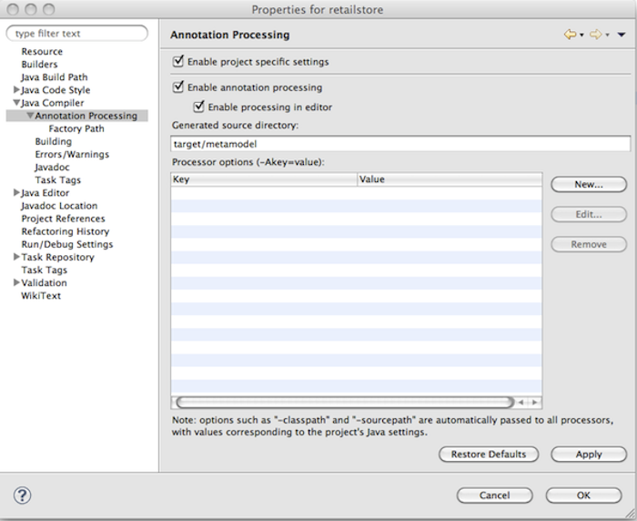

= JPA Static Metamodel Generator
:imagesdir: images
:version: {fullVersion}
:toc:

[[whatisit]]
== What is it about?

JPA 2 defines a typesafe Criteria API which allows `Criteria` queries
to be constructed in a strongly-typed manner, utilizing so called 
static metamodel classes. 
For developers it is important that the task of the metamodel generation 
can be automated.
Hibernate Static Metamodel Generator is an annotation processor based on 
http://jcp.org/en/jsr/detail?id=269[JSR_269] with the task of creating JPA 2
static metamodel classes.
The following example shows two JPA 2 entities `Order` and `Item`, together
with the metamodel class `Order_` and a typesafe query.

[[jpa2-entity-example]]
.JPA 2 annotated entities `Order` and `Item`

====
[source, JAVA]
----

@Entity
public class Order {
    @Id 
    @GeneratedValue
    Integer id;
    
    @ManyToOne 
    Customer customer;
    
    @OneToMany 
    Set<Item> items;
    BigDecimal totalCost;
    
    // standard setter/getter methods
    ...
}

@Entity  
public class Item {
    @Id
    @GeneratedValue
    Integer id;

    int quantity;

    @ManyToOne
    Order order;

    // standard setter/getter methods
    ...
}

----

====
[[metamodel-class-example]]
.Metamodel class Order_

====
[source, JAVA]
----

@StaticMetamodel(Order.class)
public class Order_ {
    public static volatile SingularAttribute<Order, Integer> id;
    public static volatile SingularAttribute<Order, Customer> customer;
    public static volatile SetAttribute<Order, Item> items;
    public static volatile SingularAttribute<Order, BigDecimal> totalCost;
}
       
----

====
[[criteria-example]]
.Typesafe citeria query

====
[source, JAVA]
----
CriteriaBuilder cb = entityManager.getCriteriaBuilder();

CriteriaQuery<Order> cq = cb.createQuery(Order.class);

SetJoin<Order, Item> itemNode = cq.from(Order.class).join(Order_.items);

cq.where( cb.equal(itemNode.get(Item_.id), 5 ) ).distinct(true);
----

====

[TIP]
====
Hibernate Static Metamodel Generator also takes into consideration xml
configuration specified in `orm.xml` or mapping files specified in
`persistence.xml`. However, if XML is your only configuration source,
you need to add in at least on of the mapping file the following 
persistence unit metadata:
----
<persistence-unit-metadata>
  <xml-mapping-metadata-complete/>
</persistence-unit-metadata>
----
====

== Canonical Metamodel

The structure of the metamodel classes is described in the JPA 2 
(JSR 317) http://jcp.org/en/jsr/detail?id=317[specification], but for
completeness the definition is repeated in the following paragraphs.
Feel free to skip ahead to the <<chapter-usage,usage chapter>>, if you
are not interested into the gory details.

The annotation processor produces for every managed entity in the
persistence unit a metamodel class based on these rules:

* For each managed class X in package p, a metamodel class X_ in 
package p is created.

* The name of the metamodel class is derived from the name of the 
managed class by appending "_" to the name of the managed class.

* The metamodel class X_ must be annotated with the 
`javax.persistence.StaticMetamodel` annotation.

* If class X extends another class S, where S is the most derived
managed class (i.e., entity or mapped superclass) extended by X, then
class X_ must extend class S_, where S_ is the metamodel class created
for S.

* For every persistent non-collection-valued attribute y declared by
class X, where the type of y is Y, the metamodel class must contain a
declaration as follows:

 public static volatile SingularAttribute<X, Y> y;

* For every persistent collection-valued attribute z declared by class
X, where the element type of z is Z, the metamodel class must contain 
a declaration as follows:
** if the collection type of z is java.util.Collection, then

 public static volatile CollectionAttribute<X, Z> z;

** if the collection type of z is java.util.Set, then

 public static volatile SetAttribute<X, Z> z;

** if the collection type of z is java.util.List, then

 public static volatile ListAttribute<X, Z> z;

** if the collection type of z is java.util.Map, then 
+
 public static volatile MapAttribute<X, K, Z> z;
+
where K is the type of the key of the map in class X

Import statements must be included for the needed `javax.persistence.metamodel` types as
appropriate and all classes X, Y, Z, and K.

[[chapter-usage]]
== Usage

The jar file for the annotation processor can be found in the 
https://search.maven.org/[Maven Central repository] under:

====
[source, XML]
[subs="verbatim,attributes"]
----
<dependency>
    <groupId>org.hibernate</groupId>
    <artifactId>hibernate-jpamodelgen</artifactId>
    <version>{version}</version>
</dependency>
----
====

Alternatively, it can be found in the ORM distribution bundle on 
https://sourceforge.net/projects/hibernate/files/hibernate-orm/[SourceForge].

In most cases the annotation processor will automatically run provided
the processor jar is added to the build classpath.
This happens due to Java's Service Provider contract and the fact
the Hibernate Static Metamodel Generator jar files contains the
file _javax.annotation.processing.Processor_ in the _META-INF/services_ directory. 

The fully qualified name of the processor itself is: 
`org.hibernate.jpamodelgen.JPAMetaModelEntityProcessor`.

=== Usage from the command line

[[usage-ant]]
==== Usage with Ant

As mentioned above, the annotation processor will run automatically
each time the Java compiler is called, provided the jar file is on the 
classpath.
Sometimes, however, it is useful to control the annotation
processing in more detail, for example if you exclusively want to run
the processor without compiling any other source files. 
The <<javac-task-example,Javac task>> configuration below shows how 
Ant can be configured to just run annotation processing.

[[javac-task-example]]
.Javac Task configuration
====
[source, XML]
----
<javac srcdir="${src.dir}"
    destdir="${target.dir}"
    failonerror="false"
    fork="true"
    classpath="${classpath}">
    <compilerarg value="-proc:only"/>
</javac>
----

====
The option _-proc:only_ instructs the compiler to just run the annotation processing.
You can also completely disable processing by specifying _-proc:none_.

[TIP]
====
Run `'javac -help'` to see which other annotation processor relevant
options can be specified.
====

==== Usage with Maven

There are several ways of running the annotation processor as part of a Maven build.
Again, it will automatically run if you are compiling with a JDK >6. 
In case you have more than one annotation processor on your classpath you can explicitly 
pass the processor option to the compiler plugin:

.Maven compiler plugin configuration - direct execution

====
[source, XML]
----
<plugin>
    <artifactId>maven-compiler-plugin</artifactId>
    <configuration>
        <source>1.8</source>
        <target>1.8</target>
        <compilerArguments>
            <processor>org.hibernate.jpamodelgen.JPAMetaModelEntityProcessor</processor>
        </compilerArguments>
    </configuration>
</plugin>
----

====
The maven-compiler-plugin approach has the disadvantage that the maven compiler plugin 
does currently not allow to specify multiple compiler arguments 
(http://jira.codehaus.org/browse/MCOMPILER-62[MCOMPILER-62]) 
and that messages from the Messenger API are suppressed 
(http://jira.codehaus.org/browse/MCOMPILER-66[MCOMPILER-66]).
A better approach is to disable annotation processing for the compiler
plugin as seen in below.

[[disable-processing-maven-compiler-plugin]]
.Maven compiler plugin configuration - indirect execution

====
[source, XML]
----
<plugin>
    <artifactId>maven-compiler-plugin</artifactId>
    <configuration>
        <source>1.8</source>
        <target>1.8</target>
        <compilerArgument>-proc:none</compilerArgument>
    </configuration>
</plugin>
----
====
Once disabled, the https://bsorrentino.github.io/maven-annotation-plugin/[maven-processor-plugin]
for annotation processing can be used:

[[maven-processor-plugin]]
.Configuration with maven-processor-plugin
====
[source, XML]
[subs="verbatim,attributes"]
----
<plugin>
    <groupId>org.bsc.maven</groupId>
    <artifactId>maven-processor-plugin</artifactId>
    <version>2.0.5</version>
    <executions>
        <execution>
            <id>process</id>
            <goals>
                <goal>process</goal>
            </goals>
            <phase>generate-sources</phase>
            <configuration>
                <processors>                                
                    <processor>org.hibernate.jpamodelgen.JPAMetaModelEntityProcessor</processor>
                </processors>
            </configuration>
        </execution>
    </executions>
    <dependencies>
        <dependency>
            <groupId>org.hibernate</groupId>
            <artifactId>hibernate-jpamodelgen</artifactId>
            <version>{version}</version>
        </dependency>
    </dependencies>
</plugin>
----
====

Another possibility is to supply the dependency as an annotation processor path to the maven-compiler-plugin:

[[maven-compiler-plugin]]
.Configuration with maven-compiler-plugin
====
[source, XML]
[subs="verbatim,attributes"]
----
<plugin>
    <groupId>org.apache.maven.plugins</groupId>
    <artifactId>maven-compiler-plugin</artifactId>
    <version>3.7.0</version>
    <configuration>
        <annotationProcessorPaths>
            <path>
                <groupId>org.hibernate</groupId>
                <artifactId>hibernate-jpamodelgen</artifactId>
                <version>{fullVersion}</version>
            </path>
        </annotationProcessorPaths>
    </configuration>
</plugin>
----
====

=== Usage within the IDE

Of course you also want to have annotation processing available in your favorite IDE. The
following paragraphs and screenshots show you how to enable the Hibernate Static Metamodel
Generator within your IDE.

==== Idea

Intellij Idea contains from version 9.x onwards a specific configuration section for 
annotation processing under the project settings window.
The screenshots show you how to configure the Hibernate Static Metamodel Generator.

image:idea-annotation-processor-config.png[]

In the annotation processor configuration, enable annotation processing and select obtain
from project classpath. 
Add the annotation processor name `org.hibernate.jpamodelgen.JPAMetaModelEntityProcessor`
(and optionally the annotation processor options).
Select the module(s) containing your entities. 
If you have configured Maven as recommended, it is best to select the same output directory
for the generated classes. 
At the time of writing, it is _target/generated-sources/apt_. That way, the generated
classes will be available in IntelliJ Idea.

==== Eclipse

In Eclipse exists also an additional configuration section under Java Compiler. 
There you can configure all kinds of aspects of annotation processing. 
Just check the "Enable annotation processing" option, configure the directory for the
generated sources and finally add the Hibernate Static Metamodel Generator and JPA 2 jar
files to the factory path.

If you use JDK 11+, you also need to add the `javax.xml.bind:jaxb-api` and
`org.glassfish.jaxb:jaxb-runtime` jars as JAXB is not included in the JDK anymore.

=== Processor specific options

The Hibernate Static Metamodel Generator accepts a series of custom 
options which can be passed to the processor in the format: `-A[property]=[value]`

The supported properties can be found in the table below:

.Hibernate Static Metamodel Generator options
|===============
|*Option name*            | *Option value and usage*

|debug                    | If set to `true` additional trace
                            information will be outputted by the processor

|persistenceXml           | Per default the processor looks in
                            _/META-INF_ for persistence.xml. Specifying
                            this option a _persitence.xml_ file from a
                            different location can be specified 
                            (has to be on the classpath)

|ormXml                   | Allows to specify additional entity mapping 
                            files. The specified value for this option is a
                            comma separated string of mapping file names. 
                            Even when this option is specified
                            _/META-INF/orm.xml_ is implicit.

|lazyXmlParsing           | Possible values are `true` or `false`. If set to
                            `true` the annotation processor tries to
                            determine whether any of the xml files has 
                            changed between
                            invocations and if unchanged skips the xml parsing.
                            This feature is experimental and contains the risk 
                            of wrong results in some cases of mixed mode
                            configurations. To determine wether a file has 
                            been modified a temporary file
                            `Hibernate-Static-Metamodel-Generator.tmp`
                            is used. This file gets created in the
                            `java.io.tmpdir` directory.

|fullyAnnotationConfigured | If set to `true` the processor will
                             ignore `orm.xml` and `persistence.xml`.

|addGeneratedAnnotation    | If set to `true` the processor will
                             add the @Generated to the generated
                             Java source file. Adding this annotation using 
                             JDK 5 will cause a compilation error. In this
                            case set the flag to false. The default for this option is `true`

|addGenerationDate         | If set to true the generation date
                             of the metamodel class will be inserted in the 
                             date parameter of the @Generated annotation. 
                             The default is `false`. This parameter is
                             ignored if _addGeneratedAnnotation_ is set
                             to _false_.
|addSuppressWarningsAnnotation| If set to `true` the processor will
                                add `@SuppressWarnings("all")` to the
                                generated Java source file. Per default this
                                annotation is not generated. See also https://hibernate.onjira.com/browse/METAGEN-50[METAGEN-50].

|===============

