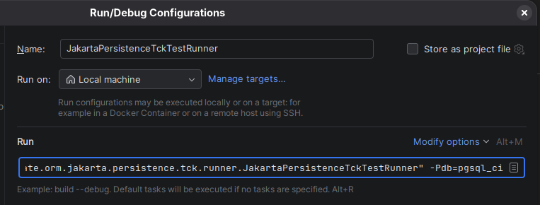

= Hibernate ORM Jakarta Persistence TCK runner module

This module pulls the Jakarta Persistence TCK tests and runs them as if they are part of the ORM build itself.

Currently, Jakarta Persistence TCK only works with Postgresql. Hence, to start working with the Jakarta Persistence TCK
within Hibernate ORM start the Postgresql database as usual with:

[source,bash]
----
./docker_db.sh postgresql
----

To run the Jakarta Persistence TCK from the terminal execute:

[source,bash]
----
./gradlew :hibernate-tck-runner:test -Pdb=pgsql_ci
----

[NOTE]
====
Make sure to include the `pgsql_ci` database parameter!
====

Tests can be executed from the IDE as well. The steps below are specific to Intellij IDEA,
but should be applicable to any other IDE.

* Go to `org.hibernate.orm.jakarta.persistence.tck.runner.JakartaPersistenceTckTestRunner`
* Run it to create a run configuration.
* Edit the newly created run configuration and add the `-Pdb=pgsql_ci` at the very end of the run command:

* Save the configuration and use it to run/debug the Jakarta Persistence TCK

== Limit the number of executed tests

To limit the number of TCK tests executed by the runner change the pattern
in the `@IncludeClassNamePatterns({".*Client.*"})` annotation (placed on the `JakartaPersistenceTckTestRunner`).

For example to run a single test you can change it to:

[source,java]
----
@Suite
@SuiteDisplayName("Jakarta Persistence TCK tests Runner")
@SelectPackages({"ee.jakarta.tck.persistence"})
@IncludeClassNamePatterns({"ee.jakarta.tck.persistence.validation.Client2.*"})
public class JakartaPersistenceTckTestRunner {

}
----
(note while this is a regular expression and the correct way to express it would be `ee\.jakarta\.tck\.persistence\.validation\.Client2`,
not escaping the dots works fine here and saves some time.)

Or for all the test classes within the package:

[source,java]
----
@Suite
@SuiteDisplayName("Jakarta Persistence TCK tests Runner")
@SelectPackages({"ee.jakarta.tck.persistence"})
@IncludeClassNamePatterns({"ee.jakarta.tck.persistence.validation..*"})
public class JakartaPersistenceTckTestRunner {

}
----

If you want to run *just a single* test method, remove/comment out the `@SelectPackages` and add a `@SelectMethod` instead:

[source,java]
----
@Suite
@SuiteDisplayName("Jakarta Persistence TCK tests Runner")
@IncludeClassNamePatterns({".*Client.*"})
@SelectMethod("ee.jakarta.tck.persistence.validation.Client2#callbackValidationNoGroupsEntityManager")
public class JakartaPersistenceTckTestRunner {

}
----
Or in a bit more "type safe" manner:

[source,java]
----
@Suite
@SuiteDisplayName("Jakarta Persistence TCK tests Runner")
@IncludeClassNamePatterns({".*Client.*"})
@SelectMethod(type = ee.jakarta.tck.persistence.validation.Client2.class, name = "callbackValidationNoGroupsEntityManager")
public class JakartaPersistenceTckTestRunner {

}
----
